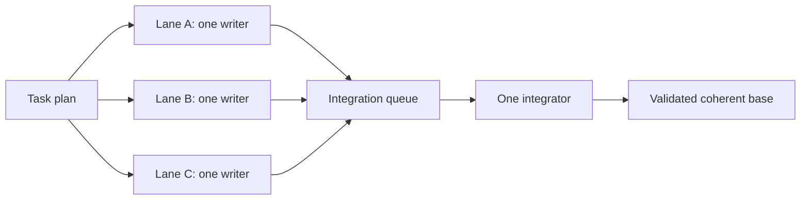

# OpenBuild

[Русская версия](README.ru.md)
OpenBuild is an explicit Codex workflow that can take a plain-language task or an existing specification from repository discovery through implementation, validation, and review. The default route is automatic: invoke Build, describe the outcome, and let it choose the first incomplete phase.
Current release: `2.4.1` ([pinned skill source](https://github.com/GeorgVahi/OpenBuild/tree/v2.4.1/plugins/openbuild/skills/build)).
OpenBuild handles routine agent orchestration itself: it activates exact agents immediately, keeps live runs under one bounded 15-minute observation window, and applies verified same-scope retry or one-rung escalation policies without repeatedly asking the user. Material product, architecture, permission, privacy, destructive, external, and publication decisions remain user-owned.

## Diagrams

### Workflow


### Exact model routing


### Implementation delegation


### Parallel task lanes



## Requirements

- Codex with plugin support;
- Python 3.11 or newer;
- Codex CLI authenticated with a saved ChatGPT login;
- Git for repository and release workflows.

OpenBuild does not require direct API credentials. Its delegated agents run as separate subscription-authenticated Codex CLI processes.

## Install or update

Remove an existing installation and marketplace source:

```powershell
codex plugin remove openbuild@openbuild
codex plugin marketplace remove openbuild
```

Add the latest pinned release and install it:

```powershell
codex plugin marketplace add GeorgVahi/OpenBuild --ref v2.4.1
codex plugin add openbuild@openbuild
```

Start a new Codex thread after installation so the updated skill is loaded.

## Usage

Invoke `$openbuild:build` and describe the desired outcome. With no explicit mode, Build works in `auto` and decides whether to create, refine, or execute a specification.

Optional modes:

- `new <idea>` — create or clarify a specification without implementation;
- `refine <path>` — reconcile an existing specification with the repository;
- `run <path>` — implement an existing specification;
- `full <idea>` — specification through implementation and review;
- `auto <idea-or-path>` — explicitly request automatic routing;
- `configure-models` — answer a guided interview to choose the first model, evidence-gated escalation steps, reasoning effort, and critical routes for discovery, specification critics, implementation, and review.

For an existing specification, pass its repository-relative or absolute path. Build never chooses among multiple plausible specification files silently.

## Parallel task lanes and automatic setup

OpenBuild now follows the project model “parallel tasks, one writer per lane, one integrator.” Independent milestones may run concurrently in separate registered Git worktrees with disjoint hard scopes and isolated port, test-database, Docker Compose, temporary, and build namespaces. A lane still has exactly one contained writer. Completed lanes keep their scopes until one project-wide integration owner validates and accepts them in order; workers never commit, integrate, allocate versions, push, tag, or publish.

Every explicit `$openbuild:build` mode runs the packaged pre-repository setup before the first repository read or discovery dispatch. A missing owner-private I0 coordinator is initialized automatically; a valid one is verified without rewrite; then Build continues the originally requested mode. The permanent coordinator key and immutable anchor lock bind all later BA0 records, intent, handoff, compaction, project generations, and transition receipts. Standard `codex plugin marketplace add` and `codex plugin add` commands do not provide an install hook, and there is no separate mandatory setup command.

If existing coordinator state is insecure, tampered, linked through a symlink/reparse point, or otherwise ambiguous, Build returns `setup-required` and stops before touching the repository. Do not delete or recreate that state blindly. Restore the coordinator root, identity lock, key, and owner-only permissions from known-good evidence for the same OS account, then rerun the original Build invocation.

Bootstrap has two explicit outcomes. Clean evidence publishes one B0 project registry at generation zero. Breach or indeterminate evidence publishes a BS incident instead, preserving protected work and blocking ordinary mutation until every target is proven vacant, drained, reconciled, and cleared. BS aliases cover the same recovery-owner operations as their ordinary registry counterparts, while all eight non-creating read/observation paths remain sink-free. Prompt staging uses one parent transition receipt across its aliases, and every durable mutation consumes one exact generation/attempt-bound transition context.

### Migration, rollback, and publication fences

Upgrade from 2.3.6 with a one-time drain: finish or safely stop active legacy Build processes, update every active client, and disable archived legacy entry points before admitting managed lanes. Exact legacy registry shapes remain readable without rewrite, but the first durable 2.4.0 transition promotes reader and writer floors. A lower-version or unregistered client cannot mutate project state, release scope, or authorize integration. An active legacy worktree remains an external protected actor and blocks conflicting admission until its vacancy is proven. A vacant project registry can be retired; downgrade or rollback is rejected while work, fences, or protected actors remain active.

This is a conditional safety guarantee, not atomic exclusion of an archived legacy binary. If a legacy process reappears or changes a worktree, index, ref, process tree, or registry after the drain, or if observation is incomplete, OpenBuild records a global-integrity incident, preserves all detected work, and safe-stops managed transitions. Reconciliation must prove the exact project/session/generation/attempt and vacancy before activity resumes.

Local version, package, and commit operations are fenced separately under `O6`; push, annotated tag, GitHub Release, public audit, and remote install/smoke are fenced under `O7`. An incident blocks both classes, but clearing a local commit fence never implies publication authority. The public status projection reports running, scope wait, capacity wait, integration wait, stale, blocked, incident, and complete outcomes without private paths, credentials, ports, nonces, or process identities.

## Exact model-routed agents

OpenBuild ships ready-to-use profiles for discovery, implementation, and review. It starts every created agent only through the packaged `codex-exec-explicit-model` runner, which supplies the exact model, reasoning effort, sandbox, and task to a separate `codex exec` process and records a terminal receipt.

Model-map and profile precedence is project override, user override, then packaged default. `$openbuild:build configure-models` builds a complete project or user map in plain language; Build resolves that map before every agent. Search models may be customized, while the canonical read-only discovery contract remains immutable. Native Explorer, name-only custom agents, generic workers, and other routes that cannot prove model and effort are not used.

Discovery returns strict `openbuild.discovery.v1` JSON. The runner fingerprints all Git tracked and untracked/non-ignored content before and after the read-only scout, then validates bounded owners, tests, couplings, flows, safe paths, and tight line ranges before root consumes anything.

The packaged route tries `gpt-5.3-codex-spark` first. If and only if that created process is fully stopped, its creation-bound nonzero Codex exit matches a clean runner exit, and structured private evidence proves Spark is unavailable to the account or its model-specific limit is exhausted, OpenBuild atomically starts one canonical `openbuild_search_balanced` Terra run with the same prompt, fingerprint, instructions, map, and profile bindings. JSONL, stderr, and result artifacts stay bound to one verified no-follow regular-file descriptor through the read; replacement between check, open, and EOF fails closed. Message-only or generic failures, auth/network/CLI/sandbox/timeout/invalid results, drift, replay, and Terra failure go directly to minimum targeted root search; there is no third agent and no fallback with unknown model metadata. Legacy complete maps without the optional availability fields keep the previous blocked behavior. Implementation and review never substitute a model after transport failure.

The packaged map advances reasoning before changing models. Low-risk implementation and review start on Luna medium, then use Luna xhigh, Terra medium, Terra xhigh, and finally Sol high only when a completed evidence trigger remains. Medium/high routes start on Terra medium, then use Terra xhigh before Sol high; critical work starts on Sol xhigh. A validated user map may select a shorter contiguous segment or a higher non-Sol start within the same risk ladder, but it cannot skip a reasoning rung, start non-critical work on Sol, use critical-only strongest outside critical, or replace the direct strongest critical route. Canonical implementation/review profile overrides must also declare their exact `routing_rung` with `routing_tuple_confirmed = true`; a known Luna/Terra/Sol model-and-effort pair must match that rung, while an unknown custom model requires an explicitly confirmed rung and capability smoke instead of inference from its name.

## Safe timeout and recovery

A bounded `wait` timeout is only an observation: OpenBuild watches the same run through progressive 45, 90 and 120 second windows, using a soft CLI exit while preserving `status: timeout`. After those checkpoints it continues observing automatically within one immutable 15-minute budget; at the hard deadline it cancels the run itself and requires full process-tree stop proof. It never releases a writer lease, starts a replacement, or changes model while the creation-bound process tree may still be alive, and it never asks the user whether to continue routine waiting. OpenBuild accepts a contained handoff only after a terminal receipt, kernel-backed full-tree zero proof, root verification, and durable finalization.

Eligible safe same-scope continuation is automatic and bounded: OpenBuild may consume the one-shot same-profile retry or existing root-completion authority only after the required zero-write or post-stop evidence. Only a new checkpoint-bound recovery target writer requires explicit user authorization. After a contained run has terminally failed, its full process tree is proven empty, and its immutable checkpoint still matches the repository, the user may explicitly authorize one recovery target for the same bounded scope. Checkpoint capture fails closed on Git status-suppressing index flags and checks every Windows path component for a reparse point, so hidden tracked edits or an ancestor junction cannot escape the allowed inventory. Immediately before activation, the registry re-captures the exact normal-source or recovery-target snapshot; drift keeps the contained lease unactivated and never opens the prompt gate. Every registry and private-source generation is checked against exact top-level and nested allowlists before durable replacement and again on reload; unknown lifecycle fields, invalid state-specific evidence, or a public checkpoint containing a raw path fail closed even when the generation digest was recomputed. A contained process-bound generation must also bind its provider and IPC plan IDs, guardian identity, affirmative precommit membership, and worker PID/creation identity to the reserved plan before reload or activation. Terminal zero proof and guardian close are complete exact records bound to that same provider, guardian and process identity. A transport-completed `BLOCKED` or verified zero-write `NEEDS_ESCALATION` result is durably rejected without a handoff before containment closes. Its disposition follows an exact matrix: `BLOCKED` retains the source checkpoint, while `NEEDS_ESCALATION` first requires a fresh private snapshot byte-equal to the authoritative pre-snapshot, cannot retain the checkpoint, and may complete only with one matching registry-history event plus reload-validated private-source invalidation. Escalation persists a resumable checkpoint-invalidation boundary: failure retains the lease, and only durable completion permits containment close, release, and the next route step. Terminal release retains a validated privacy-safe digest archive of the terminal receipt, kernel zero proof, guardian close and semantic/handoff disposition after clearing the lease. Failed or ambiguous handoffs remain unaccepted. Windows creates the worker suspended, verifies Job membership, then resumes it; Linux creates the worker directly inside cgroup v2 with `clone3(CLONE_INTO_CGROUP)` before exec and additionally proves a private cgroup/mount namespace with read-only controls, dropped capabilities, no control descriptors, and stable membership. The production Linux path has no post-spawn PID attachment helper. If that native boundary is unavailable, a normal source run may take one proved pre-boundary non-recovery fallback and recovery remains unavailable; ambiguous fallback creation, identity capture, or durable process binding retains the one-shot lease in quarantine. A bind replacement that is already visible is re-barriered and accepted only when its exact digest and process receipt match.

Version 2.4.1 makes this continuation self-healing for the incident classes that already have safe evidence and authority. Recovery snapshots use `task-relevant-v2`: allowed files, including explicitly allowed ignored files, and every Git-visible status path remain protected, while unrelated ignored `.scratch`, `node_modules`, large caches, and reparse points are not globally enumerated, opened, or charged against the checkpoint budget. Older policy-less sources continue in global `full-ignored-v1` without rewrite. After quarantine reconciliation, terminal abandonment, semantic rejection, or a false-green focused signal, an attributable partial diff proceeds through a durable root-completion audit and digest-bound automatic continuation without asking for another RUN or “direct fix” permission; creating a new writer remains a separate security decision. Every reviewer dispatch consults and appends an owner-private canonical progress ledger partitioned by a stable Build-specification lineage, review limits apply to one immutable diff revision, a remediated diff receives a fresh sequential review epoch, and an unrelated Build starts independently. If the Codex Browser is unavailable, OpenBuild may use local browser QA only when an independent network guard is attached before child execution; project/child output is never network proof, and unavailable isolation fails closed without launching the QA child.

Version 2.4.0 completes M7 legacy migration, automatic first-Build setup, documentation, and the package contract. The new migration owner verifies or initializes I0 before repository discovery, publishes clean B0 or breach BS state through immutable BA0 records, enforces reader/writer floors and protected legacy work, and fences local commit operations separately from external publication. Registry-aware validation accepts only proven `O1`–`O8` transition references while retaining negative controls for real fixed-model slugs. M8 publishes this validated immutable candidate through the stable tag and GitHub Release, then verifies remote install, automatic setup, and parallel-lane behavior.

Version 2.4.0-alpha.2 previews the M2 project-lane lifecycle across separate Git worktrees while retaining one contained writer per lane. The coordinator resolves the lane and hard scopes before dispatch; the runner verifies that private binding, routes the existing RecoveryRegistry to the lane worktree, makes the lane-local lease `running`, CAS-attaches it to the project lane, and only then releases the prompt. Two non-overlapping lanes can therefore be write-capable at once; the acceptance fixture launches two actual runner/guardian/fake-Codex process trees and requires both workers to cross the same live barrier. Failure or timeout quarantines only the affected lane. Exact containment loss closes that lane only after its own reconciliation reaches registry vacancy; an ordinary failure with a still-eligible checkpoint instead records `recovery-ready`, and only the explicitly authorized recovery target bound to that digest can re-enter the same lane while its neighbor remains live. Exact schema-1 M1 project state remains a sink-free read and is migrated only by the first locked lane-session generation CAS. A successful handoff waits for the later integration owner without releasing project scopes.

Version 2.4.0 adds ordinary post-zero reconciliation for a completed legacy `normal-contained` lease whose fresh revalidation has the single exact reason `[preexisting-dirty-overlap]`. Owner-derived `terminal-abandonment-v5` binds the run, lease, source, terminal receipt, zero proof, candidate snapshot and allowed set, then invalidates the checkpoint with `terminal-abandoned-legacy-normal-dirty-overlap` before authenticated guardian close, unsuccessful archive and same-lease release. It preserves the writer-produced bytes and Git index without accepting a handoff, diff, commit, retry, escalation, root-completion authority or artificial outside drift. Exact 2.3.6 registries remain readable without rewrite; the first durable v5 transition raises the reader floor to 2.4.0 before source invalidation, so a retained 2.3.6 lifecycle can replay its original private `_reconcile-terminal-abandonment` command when all original owner evidence remains intact.

Version 2.3.6 extends post-zero containment-loss reconciliation only for a legacy `normal-contained` lease whose fresh revalidation has the exact sorted reasons `[git-control-plane-drift, outside-set-drift, preexisting-dirty-overlap]`. Owner-derived `terminal-abandonment-v4` binds that candidate snapshot, permanently invalidates the stale checkpoint with a distinct reason, and reuses the authenticated reconciliation, close, archive, and release phases without accepting a handoff, diff, commit, or root-completion authority. The same triple remains ineligible for ordinary `_reconcile-terminal-abandonment`; every other additional/control-plane reason remains no-mutation fail-closed. Exact floors through 2.3.5 remain readable without rewrite, and the first durable 2.3.6 transition raises the floor before source invalidation.

Version 2.3.4 repairs root completion after an activated `normal-legacy` timeout. Once the failed process tree is proven stopped, the post-vacancy audit accepts that activated `normal-legacy` failure release only when it is the sole registry-history event carrying the request lease ID, no handoff exists, and the immutable run, task, profile, process identity, allowed-set digest, and specification revision binding agree. New runs persist the structured source binding before activation and repeat its digest in both the durable activated receipt and the recomputed failed/stopped terminal receipt. A 2.3.3 checkpoint-limit run whose field is absent, not explicit `null`, is accepted only through its exact migration shape and a canonical `R-<digits>` revision whose exact lowercase `r<digits>` token was already bound into its task label. Reused or mixed-kind lease history fails closed. This path starts no writer, accepts no worker handoff, and still requires independent partial-diff attribution before root-only completion.

Version 2.3.3 prevents the host controller's short default timeout from interrupting the atomic dispatch handshake: every search, critic, implementation, and review `dispatch` now receives an explicit external controller budget of at least 120 seconds (`120000` milliseconds for millisecond-based tools). That budget covers authentication preflight, containment startup, creation-bound Codex readiness, and publication of the activated receipt; it is separate from the activated run's immutable 15-minute observation budget. A controller timeout before the receipt remains a fail-closed transport failure and never authorizes a replacement writer inside the same lifecycle. The release also fixes normal implementation activation when checkpoint capture is unavailable, including `checkpoint byte limit exceeded`: the `normal-legacy` lease now carries a domain-separated lowercase SHA-256 of the requested allowed set instead of an empty `activation_allowed_set_digest`. This binding enables activation but does not claim checkpoint recovery capability.

## Progressive review

Review is sequential and read-only. Build starts at the tier required by the change risk, accepts an evidence-backed clean result, and moves one tier higher only when a concrete unresolved finding remains after remediation and validation. Every accepted review must have a successful exact-runner receipt and semantic result.

The review budget is scoped to one stable Build-specification lineage and the immutable full diff that was reviewed. A material remediation starts a fresh sequential epoch for the new diff and records canonical `openbuild.review-progress.v2` evidence with stable finding keys; a later unrelated Build starts at its own first review even in the same repository. Repeating an unchanged finding or changing only the diff without advancing validation, acceptance coverage, or finding closure ends automatic review as `automation-exhausted` instead of prompting for another procedural override.

## Repository and Git behavior

OpenBuild follows applicable `AGENTS.md` files and repository tooling, preserves unrelated worktree changes, keeps one active writer, and leaves Git operations with the root orchestrator. Destructive, external, security-sensitive, or user-authority decisions still require explicit permission.

## Development

Package validation lives in `scripts/validate_package.py`; runner and contract tests live beside it. Release rules are documented in [CONTRIBUTING.md](CONTRIBUTING.md), and release changes in [CHANGELOG.md](CHANGELOG.md).

## License

[MIT](LICENSE)
