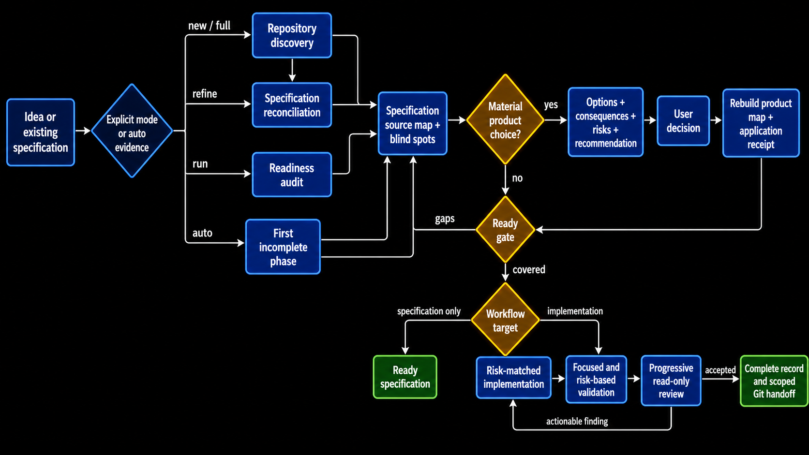
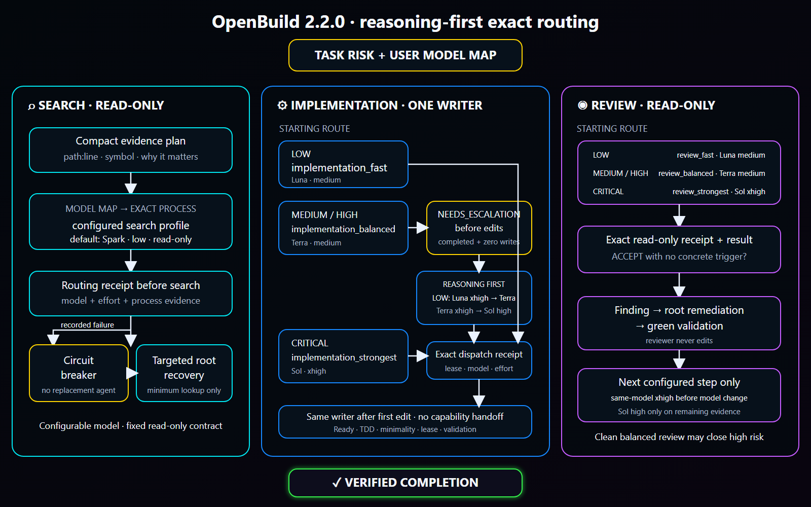
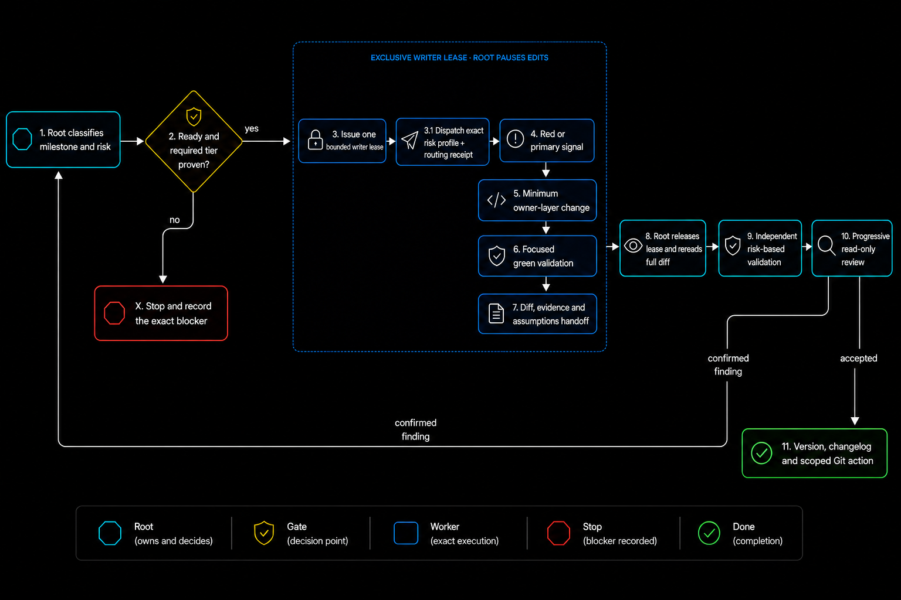

# OpenBuild

[Русская версия](README.ru.md)

OpenBuild is an explicit Codex workflow that can take a plain-language task or an existing specification from repository discovery through implementation, validation, and review. The default route is automatic: invoke Build, describe the outcome, and let it choose the first incomplete phase.

Current release: `2.2.0` ([pinned skill source](https://github.com/GeorgVahi/OpenBuild/tree/v2.2.0/plugins/openbuild/skills/build)).

## Diagrams

### Workflow



### Exact model routing



### Implementation delegation



## Requirements

- Codex with plugin support;
- Python 3.11 or newer;
- Codex CLI authenticated with a saved ChatGPT login;
- Git for repository and release workflows.

OpenBuild does not require direct API credentials. Its delegated agents run as separate subscription-authenticated Codex CLI processes.

## Install or update

Remove an existing installation and marketplace source:

```powershell
codex plugin remove openbuild@openbuild
codex plugin marketplace remove openbuild
```

Add the latest pinned release and install it:

```powershell
codex plugin marketplace add GeorgVahi/OpenBuild --ref v2.2.0
codex plugin add openbuild@openbuild
```

Start a new Codex thread after installation so the updated skill is loaded.

## Usage

Invoke `$openbuild:build` and describe the desired outcome. With no explicit mode, Build works in `auto` and decides whether to create, refine, or execute a specification.

Optional modes:

- `new <idea>` — create or clarify a specification without implementation;
- `refine <path>` — reconcile an existing specification with the repository;
- `run <path>` — implement an existing specification;
- `full <idea>` — specification through implementation and review;
- `auto <idea-or-path>` — explicitly request automatic routing;
- `configure-models` — answer a guided interview to choose the first model, evidence-gated escalation steps, reasoning effort, and critical routes for discovery, specification critics, implementation, and review.

For an existing specification, pass its repository-relative or absolute path. Build never chooses among multiple plausible specification files silently.

## Exact model-routed agents

OpenBuild ships ready-to-use profiles for discovery, implementation, and review. It starts every created agent only through the packaged `codex-exec-explicit-model` runner, which supplies the exact model, reasoning effort, sandbox, and task to a separate `codex exec` process and records a terminal receipt.

Model-map and profile precedence is project override, user override, then packaged default. `$openbuild:build configure-models` builds a complete project or user map in plain language; Build resolves that map before every agent. Search models may be customized, while the canonical read-only discovery contract remains immutable. Native Explorer, name-only custom agents, generic workers, and other routes that cannot prove model and effort are not used.

If exact discovery fails, Build records the reason and performs only the minimum targeted root search needed to continue. An exact implementation or review failure leaves that gate incomplete instead of substituting an agent with unknown model metadata.

The packaged map advances reasoning before changing models. Low-risk implementation and review start on Luna medium, then use Luna xhigh, Terra medium, Terra xhigh, and finally Sol high only when a completed evidence trigger remains. Medium/high routes start on Terra medium, then use Terra xhigh before Sol high; critical work starts on Sol xhigh. A validated user map may select a shorter contiguous segment or a higher non-Sol start within the same risk ladder, but it cannot skip a reasoning rung, start non-critical work on Sol, use critical-only strongest outside critical, or replace the direct strongest critical route. Canonical implementation/review profile overrides must also declare their exact `routing_rung` with `routing_tuple_confirmed = true`; a known Luna/Terra/Sol model-and-effort pair must match that rung, while an unknown custom model requires an explicitly confirmed rung and capability smoke instead of inference from its name.

## Safe timeout and recovery

A bounded `wait` timeout is only an observation: OpenBuild watches the same run through progressive 45, 90 and 120 second windows, using a soft CLI exit while preserving `status: timeout`. It never releases a writer lease, starts a replacement, or changes model while the creation-bound process tree may still be alive; after the third observation it reports status instead of cancelling automatically. OpenBuild accepts a contained handoff only after a terminal receipt, kernel-backed full-tree zero proof, root verification, and durable finalization.

Implementation recovery is never automatic. After a contained run has terminally failed, its full process tree is proven empty, and its immutable checkpoint still matches the repository, the user may explicitly authorize one recovery target for the same bounded scope. Checkpoint capture fails closed on Git status-suppressing index flags and checks every Windows path component for a reparse point, so hidden tracked edits or an ancestor junction cannot escape the allowed inventory. Immediately before activation, the registry re-captures the exact normal-source or recovery-target snapshot; drift keeps the contained lease unactivated and never opens the prompt gate. Every registry and private-source generation is checked against exact top-level and nested allowlists before durable replacement and again on reload; unknown lifecycle fields, invalid state-specific evidence, or a public checkpoint containing a raw path fail closed even when the generation digest was recomputed. A contained process-bound generation must also bind its provider and IPC plan IDs, guardian identity, affirmative precommit membership, and worker PID/creation identity to the reserved plan before reload or activation. Terminal zero proof and guardian close are complete exact records bound to that same provider, guardian and process identity. A transport-completed `BLOCKED` or verified zero-write `NEEDS_ESCALATION` result is durably rejected without a handoff before containment closes. Its disposition follows an exact matrix: `BLOCKED` retains the source checkpoint, while `NEEDS_ESCALATION` first requires a fresh private snapshot byte-equal to the authoritative pre-snapshot, cannot retain the checkpoint, and may complete only with one matching registry-history event plus reload-validated private-source invalidation. Escalation persists a resumable checkpoint-invalidation boundary: failure retains the lease, and only durable completion permits containment close, release, and the next route step. Terminal release retains a validated privacy-safe digest archive of the terminal receipt, kernel zero proof, guardian close and semantic/handoff disposition after clearing the lease. Failed or ambiguous handoffs remain unaccepted. Windows creates the worker suspended, verifies Job membership, then resumes it; Linux creates the worker directly inside cgroup v2 with `clone3(CLONE_INTO_CGROUP)` before exec and additionally proves a private cgroup/mount namespace with read-only controls, dropped capabilities, no control descriptors, and stable membership. The production Linux path has no post-spawn PID attachment helper. If that native boundary is unavailable, a normal source run may take one proved pre-boundary non-recovery fallback and recovery remains unavailable; ambiguous fallback creation, identity capture, or durable process binding retains the one-shot lease in quarantine. A bind replacement that is already visible is re-barriered and accepted only when its exact digest and process receipt match.

## Progressive review

Review is sequential and read-only. Build starts at the tier required by the change risk, accepts an evidence-backed clean result, and moves one tier higher only when a concrete unresolved finding remains after remediation and validation. Every accepted review must have a successful exact-runner receipt and semantic result.

## Repository and Git behavior

OpenBuild follows applicable `AGENTS.md` files and repository tooling, preserves unrelated worktree changes, keeps one active writer, and leaves Git operations with the root orchestrator. Destructive, external, security-sensitive, or user-authority decisions still require explicit permission.

## Development

Package validation lives in `scripts/validate_package.py`; runner and contract tests live beside it. Release rules are documented in [CONTRIBUTING.md](CONTRIBUTING.md), and release changes in [CHANGELOG.md](CHANGELOG.md).

## License

[MIT](LICENSE)
