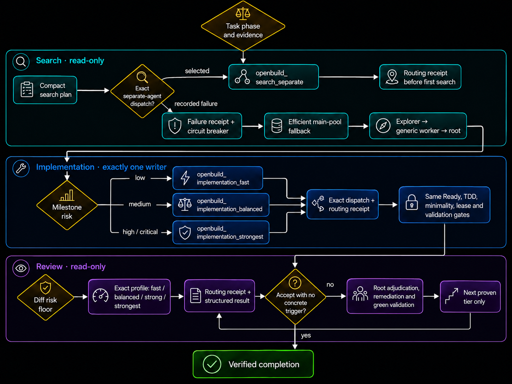

# OpenBuild

[Русская версия](README.ru.md)


OpenBuild is a Codex workflow for turning a plain-language idea or an existing specification into a repository-grounded plan and, when requested, a tested implementation with user-owned product decisions, automatic phase routing, iterative blind-spot critique, separate-usage-pool-first code search, risk-matched-model coding, bounded writers, evidence-gated minimality, TDD-first milestones, and progressive review.

It packages one explicit skill, **Build**, with six modes:

- `new` — create a specification and stop before code changes;
- `refine` — verify and improve an existing specification and stop before code changes;
- `run` — execute a ready or refinable specification;
- `full` — go from an idea through specification, implementation, validation, and review;
- `auto` — infer the target and resume at the first incomplete phase;
- `setup-models` — optionally configure permission-gated search-pool, fast/balanced/strong writer, and read-only review profiles.

OpenBuild is self-contained. It does not require separate discovery, TDD, or review skills, telemetry, a hosted service, or background network access. Exact CLI agents do require the host Codex CLI, a saved ChatGPT login, and Python 3.11 or newer.

> OpenBuild `2.1.1` is the current release. Its immutable release tag is `v2.1.1`; pin it for reproducible installation or use `main` intentionally for unreleased changes.

The manifest packaged in the release commit, immutable tag, and GitHub Release are synchronized at `2.1.1`. Earlier `v2.1.0`, `v2.0.1`, and `v1.1.1` artifacts remain immutable.

## What shipped in 2.1.1

- localized GitHub-ready workflow, usage-routing, and delegation diagrams replace the matching Mermaid blocks;
- every completed Build response reports the real logical agent runs, actual model/effort evidence or `unknown`, terminal outcome, work, and specification mapping without exposing private runtime details;
- exact CLI dispatch now has an explicit Python/Codex dependency checkpoint, permission-gated Windows installation guidance, and manual ChatGPT authentication.

## What shipped in 2.1.0

- real external Codex agents launched through explicit `-m`, `model_reasoning_effort`, and sandbox arguments instead of relying on name-only native spawning;
- two-phase `start → recorded receipt → activate` agents with creation-bound process identities, protected per-run artifacts, JSONL, creation-bound exit codes, final results, and mandatory terminal `turn.completed` evidence;
- zero-profile-setup read-only discovery on `gpt-5.3-codex-spark` with the exact delegated `rg`/`Get-Content` compact evidence-map instruction;
- ChatGPT subscription authentication and the built-in OpenAI provider enforced for external workers, with provider redirects rejected and the stable multi-agent capability disabled;
- runner-first fallback enforcement, exactly-once run-bound search evidence consumption, pre-spawn crash tracking, and null/unknown exit evidence instead of synthetic failure codes.

## What shipped in 2.0.1

- all nine OpenBuild custom-agent IDs use the runtime-safe underscore grammar;
- `agent_name` is the only profile selector, while `task_name` remains an independent task label;
- `$build setup-models` provides a hash-bound, permission-gated, resumable migration from legacy hyphenated profiles without overwriting or deleting them;
- deterministic search, implementation, review, and migration traces reject task-label substitution, stale hashes, divergent-target writes, and missing per-entry authority.

## What shipped in 1.1.1

- complete root-reachable maps of linked normative specifications, including source authority, decision provenance, editability, conflicts, and outgoing edges;
- consequence-based decision authority: every product-impacting choice stays with the user, while OpenBuild explains options, consequences, risks, affected scope, and a recommendation;
- conflict and reopen state machines that reject silent root preference, stale answers, incomplete reapplication, and changed-outcome no-ops;
- per-target decision application receipts and a `Ready` gate that proves every normative write uses the current user-approved outcome;
- the existing separate-pool discovery, risk-matched implementation, TDD, single-writer, and progressive-review contracts remain intact.

| Goal | Command | Stops at |
|---|---|---|
| Create or repair a specification | `$build new …` / `$build refine BUILD.md` | `Ready` |
| Implement an accepted specification | `$build run BUILD.md` | `Complete` |
| Run the whole lifecycle | `$build full …` | `Complete` |
| Resume from repository evidence | `$build …` / `$build auto …` | First valid terminal state |
| Configure optional model routes | `$build setup-models` | Validated profiles plus reload instructions |

## Requirements

- A current Codex surface that supports skills. Plugin installation is available in Codex CLI and supported plugin surfaces.
- Python 3.11 or newer for the packaged explicit-model runner (`python` on Windows, commonly `python3` on POSIX).
- Git, when Build is expected to create milestone commits or review a task diff.
- Windows unit, package, syntax, diff, clean-install, real Codex CLI runtime-smoke, and independent-review checks were completed for `v2.1.1`. macOS and Linux remain unverified.

OpenBuild `2.1.1` and the earlier `2.1.0`/`2.0.1`/`1.1.1` releases support Codex only. They do not claim compatibility with Claude Code, Cursor, Gemini CLI, or other coding agents.

Before the first exact CLI-agent dispatch, choose the dependency preflight for the host OS. On Windows, check both dependencies:

```powershell
python --version
codex --version
```

Python must report 3.11 or newer. If either command is unavailable, install it manually and return after it completes, or separately and explicitly authorize Build to run the applicable exact command:

```powershell
winget install -e --id Python.Python.3.12
powershell -ExecutionPolicy ByPass -c "irm https://chatgpt.com/codex/install.ps1 | iex"
```

Those `winget` and PowerShell install commands are Windows-only. On POSIX, run `python3 --version` first; use `python --version` only if `python3` is unavailable. Run `codex --version` on every platform. If a POSIX dependency is missing, Build provides manual, platform-appropriate Python and Codex CLI installation guidance; it does not choose or run a package manager automatically.

Build must wait for installation and repeat the OS-appropriate Python check plus `codex --version`. Authentication remains manual: run `codex`, complete the ChatGPT sign-in yourself, and then verify `codex login status`. Build never automates credentials. If installation or authentication is declined or unavailable, it records the limitation and uses only an honest supported fallback.

## Install as a plugin — recommended

The plugin is the primary distribution channel. It gives you versioned marketplace installation and the namespaced invocation `$openbuild:build`.

### Current pinned release `v2.1.1`

```bash
codex plugin marketplace add GeorgVahi/OpenBuild --ref v2.1.1
codex plugin add openbuild@openbuild
```

### Previous pinned release `v1.1.1`

```bash
codex plugin marketplace add GeorgVahi/OpenBuild --ref v1.1.1
codex plugin add openbuild@openbuild
```

Start a new Codex thread, then verify that `OpenBuild` is installed:

```bash
codex plugin list
```

Invoke it explicitly:

```text
$openbuild:build new Add saved searches to this application
```

### Preview from `main`

```bash
codex plugin marketplace add GeorgVahi/OpenBuild --ref main
codex plugin add openbuild@openbuild
```

Refresh a `main` installation:

```bash
codex plugin marketplace upgrade openbuild
codex plugin add openbuild@openbuild
```

### Switch between release tags

A versioned/tag-pinned marketplace is fixed to its selected tag. To move from one tag to another, remove the installed plugin and marketplace entry, then add the new tag:

```bash
codex plugin remove openbuild@openbuild
codex plugin marketplace remove openbuild
codex plugin marketplace add GeorgVahi/OpenBuild --ref v2.1.1
codex plugin add openbuild@openbuild
```

Replace `v2.1.1` with the target release tag.

### Uninstall the plugin

```bash
codex plugin remove openbuild@openbuild
codex plugin marketplace remove openbuild
```

## Install as a standalone skill

Standalone installation gives you the shorter `$build` invocation. Ask the preinstalled system skill installer to install the canonical Build folder:

```text
Use $skill-installer to install the skill from https://github.com/GeorgVahi/OpenBuild/tree/v2.1.1/plugins/openbuild/skills/build
```

To test unreleased changes, use the same path with `/tree/main/`; keep `v2.1.1` for a reproducible tagged installation.

Start a new Codex thread after installation. Open `/skills` or type `$` and verify that `build` appears, then invoke:

```text
$build new Add saved searches to this application
```

The installer refuses to overwrite an existing `$CODEX_HOME/skills/build` directory. Review that directory, back it up or remove it intentionally, and rerun the installer when updating. To uninstall the standalone version, remove only the confirmed `$CODEX_HOME/skills/build` directory and restart Codex.

The plugin and standalone channels use the same canonical source folder; there are no duplicated implementations in this repository.

## Usage

### 1. Create a specification from scratch

Plugin:

```text
$openbuild:build new Add a wishlist to the existing store
```

Standalone:

```text
$build new Add a wishlist to the existing store
```

Build will:

1. inspect the current repository and applicable `AGENTS.md` files;
2. establish a Git or artifact baseline;
3. inventory the root and every linked normative specification before synthesis, then delegate broad code search to bounded read-only discovery workers when available;
4. create stable user decision IDs, outcome-neutral technical IDs, and an evidence-backed blind-spot coverage ledger;
5. present every unresolved product choice with options, consequences, risks, and a recommendation using short answers such as `1a 2b`;
6. wait for the user, then rebuild the affected product map and record where each selected decision was applied;
7. run fresh risk-matched specification critics, deduplicate their findings, and repeat only for new gaps;
8. create `BUILD.md` in the user's language and stop before implementation once the current revision is covered.

Example question:

```text
1. [D-001] Who can keep a wishlist?
   Context: the current store has accounts, but the requested guest behavior is unspecified.
   a) Signed-in users only; the list follows the account.
   b) Guests too; the list starts locally and may merge after sign-in.
   Risks: guest support adds local persistence, merge, privacy, and recovery decisions.
   Affected product map: onboarding, wishlist storage, privacy, recovery, and acceptance criteria.
   Recommendation: 1a — it avoids an unresolved merge policy in the first version.

Reply with: 1a
```

### 2. Refine an existing specification

```text
$build refine BUILD.md
```

You can also pass `SPEC.md`, `TZ.md`, or another explicit path:

```text
$build refine docs/checkout-spec.md
```

Build first maps the selected root and every linked normative specification, then compares that graph with the current repository. It preserves manual edits and stable decisions wherever they are stored, bootstraps a coverage ledger for legacy documents, and runs fresh critics until every applicable concern is covered or explicitly not applicable. A resolved decision is never asked again unless verified new evidence reopens the same ID with its history intact. A conflict between equally authoritative documents becomes a user decision rather than a silent root-file override. If several specification files are relevant or the selected file belongs to another task, Build asks before changing anything.

### 3. Execute a specification

```text
$build run BUILD.md
```

Build first verifies current-revision readiness through the coverage gate. It classifies implementation work as `Direct`, `Investigation`, or `TDD-first`, selects root-only or one bounded implementation worker, implements coherent milestones, reruns focused validation under root ownership, performs progressive review, updates the specification log, and creates scoped milestone commits when repository policy allows. It never pushes the user's repository without explicit authorization.

### 4. Run the full workflow

```text
$build full Add organization-level API keys with rotation and audit history
```

A bare invocation is an alias for `auto`; a new feature idea still targets the full workflow, but Build selects the first incomplete phase from repository and specification evidence:

```text
$build Add organization-level API keys with rotation and audit history
```

`full` and implementation-targeted `auto` may change implementation files after the specification reaches `Ready`. They still stop for destructive operations, secrets, live infrastructure, external publication without existing authorization, or a material scope expansion.

### 5. Select the phase automatically

```text
$build auto BUILD.md
```

Explicit `new`, `refine`, `run`, or `full` remains authoritative. `auto` and a bare invocation inspect the relevant specification: `Draft` or `Questions` resumes reconciliation, legacy `Ready` without current coverage returns to critique, covered `Ready` starts implementation when requested, `In progress` resumes the earliest incomplete milestone, and `Complete` is revalidated before Build decides that no work remains or creates a new task specification.

### 6. Configure progressive model tiers

```text
$build setup-models
```

Build first checks the Codex CLI, saved ChatGPT authentication, the fixed packaged `openbuild_search_separate` route, and capabilities exposed by the current runtime. It may propose read-only `openbuild_search_fallback`; write-capable `openbuild_implementation_fast`, `openbuild_implementation_balanced`, and `openbuild_implementation_strongest`; and read-only `openbuild_review_fast`, `balanced`, `strong`, and `strongest` profiles. Existing `openbuild-discovery` remains a legacy route and is treated as separate-pool search only when its mapping is proven. Supported hyphenated OpenBuild profile names are legacy identifiers; setup detects them and proposes their underscore equivalents instead of dispatching them.

Code discovery needs no model-profile setup: OpenBuild ships a read-only `openbuild_search_separate` profile pinned exclusively to `gpt-5.3-codex-spark` with low reasoning and the compact evidence-map instruction. Codex CLI, saved ChatGPT authentication, and Python 3.11+ are still required. Same-named project or user profiles are ignored, so unavailable entitlement/model evidence opens the documented fallback circuit breaker instead of silently running another model as Spark. Other implementation and review routes remain account/runtime-configured.

Before writing anything, Build must show:

- the detected model/reasoning evidence;
- the proposed model, reasoning, usage-pool, sandbox, and role mapping;
- user scope (`~/.codex/agents`) or project scope (`.codex/agents`);
- exact target files and exact diff.

It writes only after separate permission, shows every `workspace-write` implementation profile separately, never overwrites an existing profile, and validates TOML. Setup then runs one explicit launcher smoke per distinct model/effort/sandbox tuple and accepts it only on terminal `turn.completed`. Configured profile intent is recorded separately from accepted CLI selection evidence. Declining setup leaves search, specification, and read-only review operational with honest built-in/native fallbacks; implementation proceeds only when the selected low, medium, high, or critical risk tier is satisfied.

Legacy migration is preview-first and resumable. Build shows the complete supported mapping and detected inventory, an immutable canonical-SHA `plan_id`, a content-bound `entry_id` per detected profile, scope-relative paths, root fingerprint, SHA-256 source/target/rendered-canonical values, exact TOML diffs, and one action per entry: `create-if-absent`, `already-migrated`, or `config-conflict`. Permission is stored per entry with the exact precondition hashes and action; divergent targets are never overwritten, hash drift reopens only the affected entry, and each result receipt records observed preconditions plus the result hash or `not-written`. Legacy cleanup is a later, separately approved plan after reload and exact-selection smoke.

## How automatic phase routing works

Build records two separate choices: the workflow target (`Ready` for specification-only work or `Complete` for implementation) and the first incomplete phase. Explicit modes and paths win. In `auto`, artifact evidence selects discovery, reconciliation/interview, blind-spot critique, implementation/resume, or verification; only genuine ambiguity between materially different targets or specification files becomes a routing question.

A legacy specification marked `Ready` is not trusted blindly. If it lacks the current decision memory, coverage ledger, or fresh closure evidence, Build audits it before code changes. A completed specification is revalidated against the current repository and complete acceptance evidence: the full task diff, focused and risk-based signals, documentation/version, security, migration, rollout/rollback, and review. Only then may Build no-op; otherwise it resumes the earliest invalid phase.

## How automatic code discovery works

Before any `rg`, `rg --files`, file/symbol lookup, repository grep, dependency trace, route/test/config/schema search, or log scan, the root agent creates a compact search plan and dispatches the exact `openbuild_search_separate` custom agent through the packaged `scripts/agent_runner.py`. This primary `codex-exec-explicit-model` path resolves only the fixed packaged Spark profile and starts a separate `codex exec` process with explicit `-m`, `model_reasoning_effort`, and sandbox arguments. A direct native selector is a fallback only when it exposes both model and effort; a name-only spawn is never accepted as proof of model switching. The canonical ID stays in `agent_name` and an independent descriptive label stays in `task_name`. Workers return only an evidence map with `path:line`, symbol or route, a confirmed fact, relevance, negative results, and confidence.

The root agent remains the orchestrator: it deduplicates evidence, verifies already-known critical files and lines with targeted reads, turns material product and architecture choices into decision packets, records the user's selections, makes only outcome-neutral technical decisions autonomously, owns post-decision specification/version edits, validates, owns Git, and writes the final answer. A new grep or lookup returns to the search worker. Search workers never edit or decide architecture; implementation edits use the separate risk-matched single-writer lease described below.

## How usage-aware model routing works



Search always attempts a confirmed separate-usage route first through `agent_runner.py`; the primary route is the exact custom agent `openbuild_search_separate`. The launcher requires saved ChatGPT authentication, forces the built-in OpenAI provider and ChatGPT login method, rejects redirects/custom OpenAI providers across user and project config layers, disables the stable multi-agent capability, snapshots the prompt, and records private profile/process-identity/JSONL/stderr/result/exit-code artifacts. Run directories use mode `0700` on POSIX and a protected current-user-only DACL on Windows; Linux/macOS process creation identities are precise enough to reject PID reuse before group signalling, and zombie-only POSIX groups are reaped without false liveness. `start` holds Codex stdin; Build records its unactivated receipt and only then calls `activate`, and an interrupted receipt write cleans up the still-unactivated process tree. The activated explorer performs the repository search, then Build records its stopped terminal receipt before `search-evidence-consumed`; a terminal claim can never be fabricated before the search it describes. A bounded parent wait timeout or unknown liveness is non-terminal; fallback starts only after completion, failure, or explicit `cancel` positively confirms every started process stopped. Success and cancellation recovery both require a creation-bound exit code of zero, a readable non-empty result, and exactly one final `turn.completed` JSONL event. Before the first lookup, Build records the requested agent, configured model and reasoning effort, pool, result, terminal event, and fallback reason. It then opens the current-run circuit breaker and tries an exposed direct model-plus-effort native selector, an exact-name compatibility selector with observed model/effort `unknown`, `openbuild_search_fallback`, an explorer, a generic read-only subagent, and finally minimum root search. It does not scrape the private usage dashboard, guess remaining quota, or retry a failed route for every grep.

```text
search_agent: openbuild_search_separate
task_name: <independent descriptive task label>
dispatch_method: codex-exec-explicit-model | per-spawn-model | exact-custom-agent | unavailable
configured_model: <profile/runtime value or unknown>
model_reasoning_effort: <profile/runtime value or unknown>
sandbox: read-only | unknown before any process starts
observed_agent: <runtime value or unknown>
observed_model: <runtime value or unknown>
terminal_event: turn.completed | turn.failed | none
activated: true | false
pool: separate | main | unknown
dispatch_result: selected | failed
fallback_reason: none | <recorded allowed reason>
```

The explicit CLI argv plus terminal `turn.completed` is the primary operational acceptance signal. It proves that Codex accepted the requested model/effort selection; it is not a cryptographic audit of provider-internal routing. The account usage dashboard remains optional secondary evidence.

Every completed Build response ends with an `Agents` section. Its count includes only actually created logical runs: the wrapper and its child `codex exec` are one logical run, while pre-spawn dispatch failures are listed separately. One table row is included for every created search, critic, implementation, review, native fallback, or generic fallback run, including unusable, cancelled, and timed-out runs. The columns are `Role/task`, `Actual model/effort`, `Status/outcome`, `Work`, and `AC/milestone/spec mapping`. Actual model/effort comes only from accepted explicit-dispatch or runtime evidence; otherwise it is `unknown`, even when a configured or requested model is known. The table omits private process, prompt, log, usage, and authentication data.

Code edits use an exact risk-matched writer while preserving the same Ready, TDD, minimality, single-writer, validation, and review gates at every tier. Before the first test or production edit, Build acquires the single-writer lease, then starts `openbuild_implementation_fast` for low risk, `openbuild_implementation_balanced` for medium risk, or `openbuild_implementation_strongest` for high/critical risk through `codex-exec-explicit-model --lease-id <id>`. It records the unactivated Implementation routing receipt before calling `activate`, then records the matching lease/run-bound `implementation-agent-activated` event before the first edit; the runner cannot send the task prompt earlier. The lease remains active through all edits. A successful terminal receipt with `turn.completed`, exit code zero, and valid result evidence must precede the run-bound `implementation-handoff-accepted` event, result consumption, and release. A matching failed/cancelled receipt needs complete independent failure evidence and all processes positively stopped, forbids accepted handoff, and permits release only while the milestone stays incomplete. The profile ID travels in `agent_name`; `task_name` remains a separate task label. A generic worker, task label, profile mention, or stronger-than-requested agent does not count; high and critical work still require their strong/strongest floor.

Progressive review uses the same `agent_name`/`task_name` separation and explicit CLI launcher in read-only mode: low starts with `openbuild_review_fast`, medium with `openbuild_review_balanced`, high with `openbuild_review_strong`, and critical with `openbuild_review_strongest`. Each `codex-exec-explicit-model` dispatch records an unactivated `running` Review routing receipt, a matching `review-agent-activated` event, and a stopped terminal receipt with unchanged process identities. Build consumes `review-result` only after terminal `turn.completed`, creation-bound exit code zero, and valid result evidence. Reviewers run sequentially through fast → balanced → strong → strongest from the risk floor; Build stops on sufficient acceptance evidence and advances exactly one proven tier only when a concrete trigger remains after root remediation and green validation.

Escalation is evidence-driven: Build moves to the next writer tier only when scope or risk increases, the current worker reports insufficient confidence, the red/green signal exposes a deeper owner-layer problem, validation fails for a task-scoped reason, or review confirms an actionable finding. It never launches stronger writers merely to demonstrate model switching. Exact `model` and `model_reasoning_effort` values stay in user- or project-scoped custom-agent files rather than the portable plugin.

Codex officially supports per-agent `model`, `model_reasoning_effort`, and sandbox settings and documents `gpt-5.3-codex-spark` as a separately limited preview. OpenBuild ships that exact model only for its zero-profile-setup read-only discovery profile; the runner prerequisites above still apply. Other roles remain account/runtime-configured through `$build setup-models`: [Codex pricing and usage limits](https://learn.chatgpt.com/docs/pricing#what-are-the-usage-limits-for-my-plan), [Codex subagents and model choice](https://learn.chatgpt.com/docs/agent-configuration/subagents#choosing-models-and-reasoning).

## How blind-spot critique works

Build is a bridge between user intent and code. Before `Ready`, it maps the root and all linked normative specifications, then gives every applicable concern a stable coverage ID and a state: `gap`, `covered`, or `not applicable` with evidence. The ledger covers outcomes and non-goals, actors and permissions, primary and failure flows, accessibility and localization, ownership and contracts, data and migrations, security and privacy, performance and concurrency, integrations, observability, rollout/rollback, and acceptance/testability. Task-specific concerns are added rather than forced into a generic row.

The product-impact test is consequence-based: a choice belongs to the user when it changes behavior, UX, eligibility/audience, platform or geography, permissions, privacy/data lifecycle, monetization/rewards, moderation/legal gates, compatibility, cost, rollout, acceptance criteria, or scope. These product decisions receive stable `D-###` IDs. Outcome-neutral implementation mechanisms receive stable `T-###` IDs only when they preserve every locked user choice, requirement, criterion, invariant, and observable outcome. Uncertain or mixed choices are user-owned.

A resolved ID is a locked constraint even if a later critic rephrases the same question. Reopening is allowed only when verified new repository evidence, a failing signal, an upstream constraint, or an explicit scope change materially breaks the selected outcome; Build preserves the same ID and explains what changed. Legal, platform, repository, or security evidence may remove an impossible option, but Build still explains the viable options, consequences, risks, and recommendation and waits for the user.

While a `D-###` is open, Build may add evidence, coverage, pending proposals, and questions, but it cannot rewrite the normative specification, acceptance criteria, roadmap, milestones, or linked documents around that choice. After the answer, Build applies exactly the selected IDs across dependent files and records a decision application receipt listing changed sections/criteria, preserved decisions, and any remaining open IDs. New product-impacting findings start another interview round instead of being closed as technical cleanup.

For every non-trivial revision, a fresh read-only critic receives the current specification, decision memory, coverage ledger, and repository evidence. It reports only new gaps, evidence-backed reopen requests, and duplicates linked to existing IDs. The root verifies and deduplicates findings, resolves repository facts and only outcome-neutral technical gaps itself, and asks the user up to five remaining product decisions per round. The loop continues on new revisions until the risk-appropriate fresh closure pass returns `COVERED`; the same critic perspective/tier is never repeated on an unchanged revision.

Depth follows risk: low work gets a structured self-audit and a critic when non-trivial; medium gets a fresh balanced critic and post-answer closure; high gets complementary product/UX and architecture/data/security critics plus a strong closure; critical gets adversarial perspectives, the strongest available closure, and required authority checkpoints. Exhausted critics with an open gap leave the specification out of `Ready`. This is evidence-backed closure of defined and task-specific concerns, not a claim of literal omniscience.

## How TDD-first implementation works

Behavior, contracts, validation, routing, state, auth or permissions, persistence, concurrency, integrations, security, and non-trivial user-facing changes use a red → green → refactor workflow. Build finds the narrowest supported test path, records a meaningful failing signal when practical, makes the minimum coherent owner-layer change, requires focused green validation, and refactors only after green.

Direct documentation or cosmetic work does not get ceremonial failing tests. Investigation work first reproduces or traces the failure and is reclassified as TDD-first before behavior changes. When an automated red signal is impractical, Build records why and uses the best reproducible contract or runtime signal.

Reviewers stay read-only. They audit the red signal, owning layer, focused green result, and risk-based coverage. Confirmed behavioral findings go back to the root agent, which runs remediation through the same TDD-first workflow before requesting another review.

## How adaptive implementation delegation works


After `Ready`, each milestone selects `root-only`, `bounded-worker`, or `sequential-workers`, acquires the single-writer lease for the exact minimum sufficient writer profile, starts it with that lease ID, records the unactivated `running` receipt, and then calls `activate` before any edit. The terminal receipt follows worker edits and precedes lease release. Reasoning effort scales from low/minimal for mechanical changes to the deepest supported effort for critical work. A worker is used only when the owning files, acceptance criteria, red or primary signal, and stop conditions are clear; `root-only` remains limited to documented safety cases and requires the root to satisfy the selected tier. An unavailable required tier blocks that milestone instead of authorizing a risk-floor downgrade.

The shared checkout has one active writer. A worker receives a baseline and exact allowed files, cannot edit the specification, version, changelog, or unrelated files, cannot make product or architecture decisions, and cannot stage, commit, push, publish, or deploy. The root does not edit while the lease is active. After handoff, the root rechecks the complete diff, rereads changed code, reruns focused and risk-based validation, updates durable records and versioning, and only then starts progressive review or Git actions. Multiple worker milestones run strictly sequentially.

## How evidence-gated minimality works

After the Ready gate and before code changes, Build evaluates every proposed file, dependency, abstraction, configuration surface, and compatibility layer through an evidence-gated ladder: is it needed now; does the repository already solve it; does the standard library or native platform cover it; does an installed dependency fit; and only then, what is the minimum coherent custom change in the owning layer. Build stops at the first option that satisfies the complete acceptance criteria, invariants, repository conventions, and risk constraints.

Minimality governs technical means, not accepted product scope. It never trades away supported tests, trust-boundary validation, security, privacy, accessibility, data-loss handling, error handling, observability, compatibility, migration or rollback safety, concurrency correctness, or required performance. A deliberate simplification with a known ceiling records that ceiling and an observable upgrade trigger instead of building the speculative upgrade immediately.

Reviewers audit the completed diff for duplicated sources of truth, avoidable dependencies, custom code covered by standard or native capabilities, speculative abstractions or configuration, and downstream symptom patches. Line count and code golf are not success metrics; a finding is actionable only when the smaller path preserves accepted behavior and risk coverage.

## How progressive review works

Build classifies each task as `low`, `medium`, `high`, or `critical`. It starts at the minimum sufficient review tier rather than always wasting a strongest-model pass:

| Complexity | Typical work | Starting review request |
|---|---|---|
| `low` | Documentation or mechanical local changes | `openbuild_review_fast` |
| `medium` | Contained behavior or refactoring with tests | `openbuild_review_balanced` |
| `high` | Cross-layer state, public contracts, persistence, concurrency, auth, permissions, privacy | `openbuild_review_strong` |
| `critical` | Irreversible actions, live infrastructure, secrets, destructive migration | `openbuild_review_strongest` |

Reviewers return acceptance coverage, evidence-backed findings, confidence, a verdict, and an optional score. After confirmed findings are fixed and validation reruns, Build escalates when confidence is low, coverage is incomplete, reviewers conflict, validation fails, a high-impact finding remains, or the diff changed materially. A score below `9.5` triggers escalation only when the reviewer ties it to a concrete finding, uncertainty, or coverage gap.

The score is only a secondary escalation signal. An evidence-backed accept verdict with sufficient confidence, green validation, complete acceptance coverage, and no confirmed actionable findings is enough even when a score is omitted or below `9.5` without a concrete gap. Reviewers are exact-dispatched one at a time, each with a read-only sandbox and Review routing receipt. The loop starts at the risk floor, follows fast → balanced → strong → strongest without skipping a proven tier, and never repeats the same reviewer on an unchanged diff.

When Codex does not expose a model selector, Build does not invent one. It falls back through configured profiles, supported reasoning efforts, a read-only explorer role, a generic subagent, and finally root-only self-review. The effective mode and any unknown tier are recorded explicitly.

## Specification resolution

Build uses an explicit path when provided. Otherwise it prefers a relevant `BUILD.md`, then a relevant `SPEC.md` or `TZ.md`, and creates `BUILD.md` for a new task. It never silently replaces a specification that belongs to another task. `auto` also inspects the selected document's status, revision, coverage, and incomplete milestones to choose the starting phase.

## Git and safety policy

- Existing user changes remain out of scope unless the specification explicitly includes them.
- `new`, `refine`, and specification-targeted `auto` may edit only the specification.
- `run`, `full`, and implementation-targeted `auto` may edit implementation files after the Ready gate.
- Milestone commits are created when Git is available, changes can be isolated, and applicable instructions do not forbid commits.
- Push always requires explicit authorization.
- Model configuration requires a separate preview and permission.
- Discovery workers, specification critics, and reviewers are read-only. A bounded implementation worker may edit only one leased file set; writers never overlap. The user owns material product outcomes; the root owns the interview, recommendations, outcome-neutral technical choices, authorized specification/version edits, handoff validation, Git, and final reporting.
- No telemetry, daemon, `curl | shell`, hidden auto-update, or background network service is included.
- Build follows the repository's `AGENTS.md`, sandbox, approval, validation, and security rules.

## Versioning and commits

Before a milestone or final commit, Build discovers the repository's authoritative version source and policy, then records `version impact` as `not applicable`, `prerelease`, `patch`, `minor`, or `major`. In a versioned repository, every Build-created commit receives a unique higher version by default, with the changelog and required documentation updated in that same commit.

Build does not invent versioning for an unversioned repository, and it follows an explicit repository policy that uses release-only or generated versions. OpenBuild itself requires a bump for every commit after the repository root, including prose, internal validation changes, and otherwise empty commits. Build never moves a published tag. Tag creation, GitHub Release creation, package publication, and promotion from prerelease to stable remain separately authorized publication actions.

OpenBuild's own contributor, version, commit, and release rules are documented in [CONTRIBUTING.md](CONTRIBUTING.md).

## Troubleshooting

### The skill does not appear

- Start a new thread or restart Codex after installation.
- For the plugin, run `codex plugin list` and confirm `openbuild@openbuild` is installed and enabled.
- Open `/skills` or type `$` to inspect discovered skills.
- Use `$openbuild:build` for the plugin and `$build` for standalone installation.

### Both `$build` and `$openbuild:build` appear

You installed both channels. They use the same source but are separate local installations. Prefer the namespaced plugin invocation or intentionally remove the standalone `$CODEX_HOME/skills/build` directory.

### Model switching is reported as unavailable or unverified

Run `$build setup-models`, reload Codex or start a new thread, and inspect the search routing receipt on the next Build run. If the fixed packaged Spark route fails and no direct native selector exposes model plus effort, OpenBuild cannot prove that a fallback used a separate quota or that an observed model switch occurred. A generic subagent or task name does not count as selecting `openbuild_search_separate`; Build must report an explicit fallback reason instead. It can still use honest read-only fallbacks. For implementation, configured fast or balanced named profiles may proceed with runtime metadata recorded as `unknown`; high and critical milestones stop unless their required strong/strongest route can be selected.

### Build refuses to overwrite a specification

The discovered file is ambiguous or belongs to another task. Pass the intended path explicitly or choose a descriptive file such as `BUILD-wishlist.md`.

### The worktree is already dirty

Build records the initial status, excludes unrelated changes, and commits only task-scoped files. If changes cannot be isolated safely, it stops before committing rather than hiding or publishing them.

## Development and validation

See [CONTRIBUTING.md](CONTRIBUTING.md) for the `main` workflow, Semantic Versioning rules, same-commit version gate, and immutable release checklist.

From the repository root:

```bash
python -m unittest discover -s scripts -p "test_*.py" -v
python scripts/validate_package.py
```

The release process also runs the official Codex skill and plugin validators, clean plugin installation, standalone installation from the tagged GitHub path, forward-tests for `new`, `refine`, `run`, `auto`, duplicate-decision suppression, evidence-backed reopening, risk-adaptive critic closure, exact separate-agent dispatch, routing-receipt trace fixtures, circuit-breaker fallback, risk-matched writer selection and escalation, single-writer handoff, evidence-gated minimality, TDD-first remediation, and model-routing fallbacks, and a fresh full-diff review.

Useful official references:

- [Build skills](https://learn.chatgpt.com/docs/build-skills)
- [Build plugins](https://learn.chatgpt.com/docs/build-plugins)
- [Codex subagents and custom agents](https://learn.chatgpt.com/docs/agent-configuration/subagents)
- [Codex pricing and usage limits](https://learn.chatgpt.com/docs/pricing#what-are-the-usage-limits-for-my-plan)

## License

[MIT](LICENSE)
