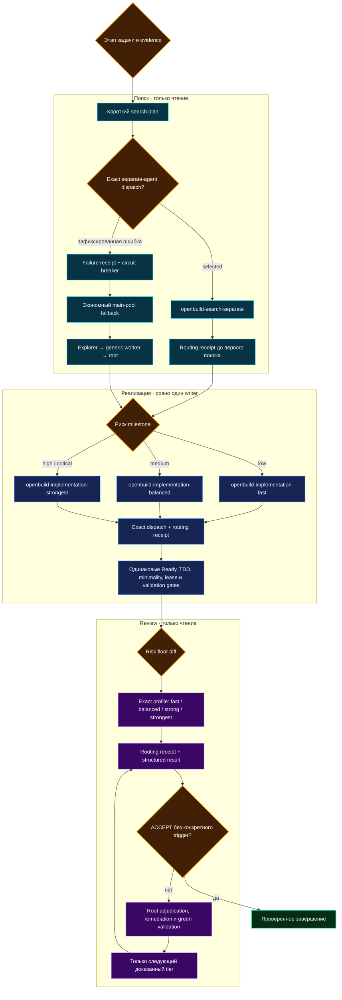

# OpenBuild

[English version](README.md)

OpenBuild — workflow для Codex, который превращает идею простыми словами или существующее ТЗ в проверенную по репозиторию спецификацию и, когда это запрошено, в протестированную реализацию с автоматическим выбором этапа, итеративной критикой blind spots, separate-usage-pool-first поиском кода, risk-matched-model coding, ограниченными writers, evidence-gated minimality, TDD-first milestones и прогрессивным review.

В plugin входит один явно вызываемый skill **Build** с шестью режимами:

- `new` — создать спецификацию и остановиться до изменений кода;
- `refine` — проверить и улучшить существующую спецификацию без изменений кода;
- `run` — выполнить готовую или дополняемую спецификацию;
- `full` — пройти путь от идеи до реализации, проверок и review;
- `auto` — определить цель и продолжить с первого незавершённого этапа;
- `setup-models` — при желании настроить с отдельным разрешением профили search pools, fast/balanced/strong writers и read-only review.

OpenBuild самодостаточен. Ему не нужны отдельные discovery-, TDD- или review-skills, telemetry, внешний сервис или фоновые сетевые процессы.

> OpenBuild `1.0.4` — текущий релиз. Immutable release tag — `v1.0.4`; закрепляйте его для воспроизводимой установки или осознанно используйте `main` для ещё не выпущенных изменений.

Plugin manifest, immutable release tag и GitHub Release синхронизированы на версии `1.0.4`.

## Что вошло в 1.0.4

- exact dispatch `openbuild-search-separate` до поиска по репозиторию, с наблюдаемым receipt и ограниченным circuit breaker для fallback;
- exact risk-matched implementation profiles до правок кода: fast для low risk, balanced для medium и strongest для high/critical;
- последовательный read-only review от risk floor задачи с переходом ровно на один доказанный tier только при оставшемся конкретном trigger;
- автоматическое продолжение lifecycle, evidence-backed закрытие blind spots, TDD-first milestones, evidence-gated minimality и безопасная граница single-writer/root-handoff;
- детерминированные contract- и trace-тесты routing, receipts, risk floors, reviewer escalation, versioning и двуязычной документации.

## Workflow в одной схеме

```mermaid
flowchart LR
    A["Идея или существующая спецификация"] --> B{"Явный режим или auto evidence"}
    B -->|new / full| C["Исследование репозитория"]
    B -->|refine| D["Сверка спецификации"]
    B -->|run| E["Проверка готовности"]
    B -->|auto| F["Первый незавершённый этап"]
    C --> D
    F --> C
    F --> D
    F --> E
    D --> G["Покрытие blind spots и решения"]
    G --> H{"Ready gate"}
    H -->|есть gaps| D
    H -->|покрыто| T{"Цель workflow"}
    E --> H
    T -->|только спецификация| Q["Готовая спецификация"]
    T -->|реализация| I["Реализация моделью по риску"]
    I --> J["Focused и risk-based validation"]
    J --> K["Progressive read-only review"]
    K -->|actionable finding| I
    K -->|принято| L["Complete record и scoped Git handoff"]

    classDef input fill:#0f172a,color:#f8fafc,stroke:#38bdf8,stroke-width:2px;
    classDef phase fill:#172554,color:#eff6ff,stroke:#60a5fa,stroke-width:1.5px;
    classDef gate fill:#422006,color:#fffbeb,stroke:#f59e0b,stroke-width:2px;
    classDef done fill:#052e16,color:#ecfdf5,stroke:#34d399,stroke-width:2px;
    class A,B input;
    class C,D,E,F,G,I,J,K phase;
    class H,T gate;
    class Q,L done;
```



| Цель | Команда | Где остановится |
|---|---|---|
| Создать или исправить спецификацию | `$build new …` / `$build refine BUILD.md` | `Ready` |
| Реализовать принятую спецификацию | `$build run BUILD.md` | `Complete` |
| Выполнить полный lifecycle | `$build full …` | `Complete` |
| Продолжить по evidence репозитория | `$build …` / `$build auto …` | Первое корректное конечное состояние |
| Настроить optional model routes | `$build setup-models` | Проверенные profiles и инструкция по reload |

## Требования

- Актуальная поверхность Codex с поддержкой skills. Установка plugins доступна в Codex CLI и поддерживаемых plugin-поверхностях.
- Git, если Build должен создавать milestone-коммиты или проверять task diff.
- Для `v1.0.4` нативно проверен Windows. Документация для macOS и Linux считается best-effort до отдельных нативных проверок.

OpenBuild `1.0.4` поддерживает только Codex. Совместимость с Claude Code, Cursor, Gemini CLI и другими coding agents не заявляется.

## Установка как plugin — рекомендуется

Plugin — основной канал распространения. Он даёт версионированную установку через marketplace и namespaced-вызов `$openbuild:build`.

### Закреплённый релиз `v1.0.4`

```bash
codex plugin marketplace add GeorgVahi/OpenBuild --ref v1.0.4
codex plugin add openbuild@openbuild
```

Начните новый Codex thread и проверьте установку:

```bash
codex plugin list
```

Явный вызов:

```text
$openbuild:build new Добавить сохранённые поиски в приложение
```

### Preview из `main`

```bash
codex plugin marketplace add GeorgVahi/OpenBuild --ref main
codex plugin add openbuild@openbuild
```

Обновление установки из `main`:

```bash
codex plugin marketplace upgrade openbuild
codex plugin add openbuild@openbuild
```

### Переход между release tags

Versioned/tag-pinned marketplace закреплён за выбранным tag. Для перехода на другую версию удалите установленный plugin и запись marketplace, затем добавьте новый tag:

```bash
codex plugin remove openbuild@openbuild
codex plugin marketplace remove openbuild
codex plugin marketplace add GeorgVahi/OpenBuild --ref v1.0.4
codex plugin add openbuild@openbuild
```

Замените `v1.0.4` на нужный release tag.

### Удаление plugin

```bash
codex plugin remove openbuild@openbuild
codex plugin marketplace remove openbuild
```

## Установка как standalone skill

Standalone-установка даёт короткий вызов `$build`. Попросите предустановленный системный skill-installer установить canonical папку Build:

```text
Используй $skill-installer и установи skill из https://github.com/GeorgVahi/OpenBuild/tree/v1.0.4/plugins/openbuild/skills/build
```

Чтобы проверить ещё не выпущенные изменения, используйте тот же путь с `/tree/main/`; для воспроизводимой tagged-установки оставьте `v1.0.4`.

После установки начните новый Codex thread. Откройте `/skills` или введите `$`, убедитесь, что появился `build`, и вызовите:

```text
$build new Добавить сохранённые поиски в приложение
```

Installer не перезаписывает существующую папку `$CODEX_HOME/skills/build`. При обновлении сначала проверьте её, осознанно сделайте backup или удалите и повторите установку. Для удаления standalone-версии удалите только подтверждённую папку `$CODEX_HOME/skills/build` и перезапустите Codex.

Plugin и standalone используют одну canonical source-папку; дублирующихся реализаций в репозитории нет.

## Использование

### 1. Создать спецификацию с нуля

Plugin:

```text
$openbuild:build new Добавить список желаний в существующий магазин
```

Standalone:

```text
$build new Добавить список желаний в существующий магазин
```

Build:

1. изучит текущий репозиторий и применимые `AGENTS.md`;
2. зафиксирует Git- или artifact-baseline;
3. по возможности делегирует широкий поиск кода ограниченным read-only discovery workers, затем проверит их evidence map;
4. создаст стабильные IDs решений и evidence-backed coverage ledger для blind spots;
5. задаст только оставшиеся продуктовые вопросы с короткими ответами вида `1а 2б`;
6. запустит свежих critics подходящей глубины, дедуплицирует findings и повторит цикл только для новых gaps;
7. создаст `BUILD.md` на языке пользователя и остановится до реализации, когда текущая revision полностью покрыта.

Пример вопроса:

```text
1. [D-001] Кто может сохранять список желаний?
   а) Только авторизованные пользователи; список привязан к аккаунту.
   б) Также гости; локальный список может объединиться после входа.
   Рекомендация: 1а — в первой версии не потребуется отдельная политика merge.

Можно ответить: 1а
```

### 2. Улучшить существующую спецификацию

```text
$build refine BUILD.md
```

Можно передать `SPEC.md`, `TZ.md` или любой явный путь:

```text
$build refine docs/checkout-spec.md
```

Build сверит документ с текущим репозиторием, сохранит ручные правки и стабильные решения, создаст coverage ledger для legacy-документа и будет запускать свежих critics, пока каждая применимая область не станет covered или обоснованно not applicable. Решённый вопрос не задаётся повторно, пока проверенное новое evidence не переоткроет тот же ID с сохранением истории. Если подходят несколько файлов или выбранный документ относится к другой задаче, Build спросит до изменений.

### 3. Выполнить спецификацию

```text
$build run BUILD.md
```

Build сначала проверит readiness текущей revision через coverage gate. Затем классифицирует реализацию как `Direct`, `Investigation` или `TDD-first`, выберет root-only или одного bounded implementation worker, выполнит когерентные milestones, независимо перезапустит focused validation под контролем root, проведёт progressive review, обновит журнал спецификации и создаст scoped milestone-коммиты, если политика репозитория разрешает. Push пользовательского репозитория без явного разрешения не выполняется.

### 4. Полный цикл

```text
$build full Добавить API-ключи организаций с ротацией и аудитом
```

Вызов без режима считается `auto`; новая идея по-прежнему нацелена на полный цикл, но Build выбирает первый незавершённый этап по evidence репозитория и спецификации:

```text
$build Добавить API-ключи организаций с ротацией и аудитом
```

`full` и implementation-targeted `auto` могут менять реализацию после достижения Ready-gate. Build всё равно остановится перед разрушительными действиями, секретами, live-инфраструктурой, внешней публикацией без уже выданного разрешения или существенным расширением scope.

### 5. Автоматически выбрать этап

```text
$build auto BUILD.md
```

Явные `new`, `refine`, `run` и `full` остаются приоритетными. `auto` и вызов без режима проверяют выбранную спецификацию: `Draft` или `Questions` продолжает reconciliation, legacy `Ready` без актуального coverage возвращается к critique, покрытый `Ready` при необходимости начинает реализацию, `In progress` продолжает первый незавершённый milestone, а `Complete` сначала перепроверяется, после чего Build либо подтверждает отсутствие работы, либо создаёт спецификацию новой задачи.

### 6. Настроить уровни моделей

```text
$build setup-models
```

Build сначала проверит возможности текущего Codex runtime. Если native selection уже предоставляет все routes, файлы не нужны. Иначе Build может предложить read-only `openbuild-search-separate` и `openbuild-search-fallback`; write-capable `openbuild-implementation-fast`, `openbuild-implementation-balanced` и `openbuild-implementation-strongest`; а также read-only profiles `openbuild-review-fast`, `balanced`, `strong` и `strongest`. Существующий `openbuild-discovery` остаётся legacy-route и считается separate-pool поиском только при доказанном mapping.

До записи Build обязан показать:

- evidence доступных моделей и reasoning efforts;
- предлагаемое распределение моделей, reasoning, usage pools, sandbox и roles;
- scope: пользовательский `~/.codex/agents` или проектный `.codex/agents`;
- точные пути и полный diff.

Запись выполняется только после отдельного разрешения; каждый `workspace-write` implementation profile показывается отдельно. Существующие profiles не перезаписываются, TOML проверяется, а после reload/new session configured-profile evidence записывается отдельно от observed runtime metadata. Отказ от setup сохраняет честные zero-config fallbacks для поиска, спецификации и read-only review; реализация продолжается только когда удовлетворён выбранный low, medium, high или critical risk tier.

## Как работает автоматический выбор этапа

Build отдельно записывает цель workflow (`Ready` для работы только над спецификацией или `Complete` для реализации) и первый незавершённый этап. Явные режимы и пути имеют приоритет. В `auto` evidence артефактов выбирает discovery, reconciliation/interview, blind-spot critique, implementation/resume или verification; только настоящая неоднозначность между существенно разными целями или файлами становится routing-вопросом.

Legacy-спецификация со статусом `Ready` не принимается вслепую. Если в ней нет актуальной decision memory, coverage ledger или свежего closure evidence, Build проверит её до изменений кода. Завершённая спецификация перепроверяется по текущему репозиторию и полному acceptance evidence: полному task diff, focused и risk-based signals, документации/версии, security, migration, rollout/rollback и review. Только после этого допустим no-op; иначе Build возвращается к самому раннему невалидному этапу.

## Как работает автоматический поиск по коду

Перед любым `rg`, `rg --files`, поиском файла/symbol, repository grep, трассировкой зависимостей, поиском routes/tests/configs/schemas или log scan главный агент составляет короткий search plan и запускает exact custom agent `openbuild-search-separate`. Direct per-spawn model selector имеет приоритет, когда runtime его предоставляет; иначе Build выбирает custom agent по точному имени. Generic worker, описательный task name или простое упоминание profile не считаются выбором модели. Workers возвращают только evidence map: `path:line`, symbol или route, подтверждённый факт, его значение, negative results и confidence.

Главный агент остаётся оркестратором: убирает дубли, точечно перечитывает уже известные критические файлы и строки, принимает продуктовые и архитектурные решения, владеет durable edits спецификации и версии, валидирует, управляет Git и отвечает пользователю. Новый grep или lookup снова идёт search worker. Search workers не редактируют код и не выбирают архитектуру; implementation edits используют отдельную risk-matched single-writer lease ниже.

## Как работает usage-aware routing моделей



Поиск всегда сначала пытается использовать подтверждённый separate-usage route — обычно exact custom agent `openbuild-search-separate` или эквивалентный native selector. Текущий Spark preview является официальным примером отдельно лимитируемой near-instant text-модели, когда account/runtime его предоставляет, но OpenBuild не закрепляет этот пример как универсальный model ID. До первого lookup Build записывает requested agent, dispatch method, configured и observed model, pool, result и fallback reason. Fallback разрешён только после `profile-not-discoverable`, `selector-unavailable`, `model-unavailable`, `quota-exhausted`, `spawn-failed` либо timeout/unusable evidence уже выбранного worker. После этого Build включает circuit breaker на текущий run и пробует `openbuild-search-fallback`, explorer, generic read-only subagent и минимальный root search. OpenBuild не скрейпит приватную usage page, не угадывает остаток quota и не повторяет неудачный separate route перед каждым grep.

```text
search_agent: openbuild-search-separate
dispatch_method: per-spawn-model | exact-custom-agent | unavailable
configured_model: <profile/runtime value or unknown>
observed_agent: <runtime value or unknown>
observed_model: <runtime value or unknown>
pool: separate | main | unknown
dispatch_result: selected | failed
fallback_reason: none | <зафиксированная допустимая причина>
```

Этот routing receipt является primary acceptance signal. Account usage dashboard остаётся полезным secondary evidence, но не заменяет наблюдаемый exact-agent dispatch.

Code edits выполняет exact risk-matched writer при сохранении одинаковых Ready, TDD, minimality, single-writer, validation и review gates на каждом tier. До первой правки test или production code Build dispatch-ит `openbuild-implementation-fast` для low risk, `openbuild-implementation-balanced` для medium risk или `openbuild-implementation-strongest` для high/critical risk и записывает Implementation routing receipt. Generic worker, task label, упоминание profile или более сильный, чем запрошено, agent не считаются выбором route. Отсутствие model metadata само по себе не блокирует exact configured low или medium route, но Build записывает его как `unknown` и не заявляет наблюдаемое переключение или экономию. High и critical work по-прежнему требуют своего strong/strongest floor.

Progressive review применяет то же правило exact selection в read-only режиме: low начинает `openbuild-review-fast`, medium — `openbuild-review-balanced`, high — `openbuild-review-strong`, critical — `openbuild-review-strongest`. Каждый dispatch создаёт Review routing receipt. Reviewers запускаются последовательно по лестнице fast → balanced → strong → strongest от risk floor; Build останавливается при достаточном acceptance evidence и переходит ровно на один доказанный tier выше только когда после root remediation и green validation остаётся конкретный trigger.

Эскалация выполняется только по evidence: Build переходит на следующий writer tier при росте scope или risk, недостаточной уверенности worker, более глубокой owner-layer проблеме в red/green signal, task-scoped validation failure или подтверждённом review finding. Более сильные writers не запускаются только ради демонстрации model switching. Точные `model` и `model_reasoning_effort` остаются в user- или project-scoped custom-agent files, а не в portable plugin.

Codex официально поддерживает per-agent `model`, `model_reasoning_effort` и sandbox settings и документирует Spark preview как separately limited. Поскольку availability меняется, `$build setup-models` обязан проверить текущий mapping account/runtime до записи profiles: [Codex pricing и usage limits](https://learn.chatgpt.com/docs/pricing#what-are-the-usage-limits-for-my-plan), [Codex subagents и выбор модели](https://learn.chatgpt.com/docs/agent-configuration/subagents#choosing-models-and-reasoning).

## Как работает критика blind spots

До `Ready` Build присваивает каждой применимой области стабильный coverage ID и статус: `gap`, `covered` или `not applicable` с evidence. Ledger покрывает outcome и non-goals, actors и permissions, основные и ошибочные flows, accessibility и localization, ownership и contracts, данные и migrations, security и privacy, performance и concurrency, integrations, observability, rollout/rollback и acceptance/testability. Специфичные для задачи области добавляются отдельно, а не прячутся в общей строке.

Продуктовые решения получают стабильные IDs `D-###`. Решённый ID становится зафиксированным ограничением, даже если следующий critic переформулирует тот же вопрос. Переоткрытие допустимо только когда проверенное новое evidence репозитория, failing signal, upstream-ограничение или явное изменение scope материально ломает выбранный outcome; Build сохраняет тот же ID и объясняет, что изменилось.

Для каждой нетривиальной revision свежий read-only critic получает актуальную спецификацию, decision memory, coverage ledger и evidence репозитория. Он возвращает только новые gaps, evidence-backed reopen requests и дубли со ссылками на существующие IDs. Root проверяет и дедуплицирует findings, самостоятельно закрывает repository и technical gaps и задаёт пользователю до пяти оставшихся продуктовых решений за раунд. Цикл продолжается на новых revisions, пока свежий closure pass подходящей глубины не вернёт `COVERED`; одна perspective/tier не повторяется на неизменённой revision.

Глубина зависит от риска: low-задача получает structured self-audit и critic, если она нетривиальна; medium — свежего balanced critic и closure после ответов; high — complementary product/UX и architecture/data/security critics плюс strong closure; critical — adversarial perspectives, strongest available closure и необходимые authority checkpoints. Если critics исчерпаны, а gap остался, спецификация не получает `Ready`. Это evidence-backed покрытие определённых и task-specific областей, а не заявление о буквальном всеведении.

## Как работает TDD-first реализация

Изменения поведения, контрактов, validation, routing, state, auth/permissions, persistence, concurrency, integrations, security и нетривиального пользовательского поведения идут по циклу red → green → refactor. Build находит самый узкий поддерживаемый test path, по возможности фиксирует осмысленный failing signal, вносит минимальное когерентное изменение во владеющем слое, требует focused green validation и рефакторит только после green.

Для документации и косметических Direct-изменений искусственный failing test не создаётся. Investigation сначала воспроизводит или трассирует проблему и перед изменением поведения переклассифицируется в TDD-first. Если автоматический red signal непрактичен, Build записывает причину и использует лучший воспроизводимый contract/runtime signal.

Reviewers остаются read-only. Они проверяют red signal, owning layer, focused green result и покрытие по риску. Подтверждённые behavioral findings возвращаются главному агенту, который проводит remediation через тот же TDD-first workflow и только затем запускает следующий review.

## Как работает адаптивная делегация реализации

```mermaid
flowchart LR
    A["Root классифицирует milestone и risk"] --> B{"Ready и required tier доказаны?"}
    B -->|нет| X["Остановиться и записать точный blocker"]
    B -->|да| C["Dispatch exact risk profile + routing receipt"]

    subgraph LEASE["Эксклюзивная writer lease · root не редактирует"]
        C --> C1["Выдать одну bounded writer lease"]
        C1 --> D["Red или primary signal"]
        D --> E["Минимальная owner-layer правка"]
        E --> F["Focused green validation"]
        F --> G["Handoff diff, evidence и assumptions"]
    end

    G --> H["Root закрывает lease и перечитывает весь diff"]
    H --> I["Независимая risk-based validation"]
    I --> J["Progressive read-only review"]
    J -->|confirmed finding| A
    J -->|принято| K["Version, changelog и scoped Git action"]

    classDef root fill:#0f172a,color:#f8fafc,stroke:#38bdf8,stroke-width:2px;
    classDef gate fill:#422006,color:#fffbeb,stroke:#f59e0b,stroke-width:2px;
    classDef worker fill:#172554,color:#eff6ff,stroke:#60a5fa,stroke-width:1.5px;
    classDef stop fill:#450a0a,color:#fef2f2,stroke:#f87171,stroke-width:2px;
    classDef done fill:#052e16,color:#ecfdf5,stroke:#34d399,stroke-width:2px;
    class A,H,I,J root;
    class B gate;
    class C,C1,D,E,F,G worker;
    class X stop;
    class K done;
```



После `Ready` каждый milestone выбирает `root-only`, `bounded-worker` или `sequential-workers`, затем dispatch-ит exact minimum sufficient writer profile по риску milestone и записывает routing receipt до lease или правки. Reasoning effort масштабируется от low/minimal для механических правок до самого глубокого поддерживаемого для critical-задач. Worker используется только когда понятны owning files, acceptance criteria, red или primary signal и stop conditions; `root-only` ограничен документированными safety cases и требует, чтобы root удовлетворял выбранному tier. Недоступный required tier блокирует milestone, а не разрешает снижение risk floor.

В общем checkout одновременно пишет только один агент. Worker получает baseline и точный список разрешённых файлов, не меняет спецификацию, version, changelog или чужие файлы, не принимает продуктовых и архитектурных решений и не выполняет stage, commit, push, publish или deploy. Пока lease активна, root не редактирует файлы. После handoff root перепроверяет полный diff, перечитывает код, независимо перезапускает focused и risk-based validation, обновляет durable records и versioning и только затем начинает progressive review или Git-действия. Несколько worker milestones выполняются строго последовательно.

## Как работает evidence-gated minimality

После Ready-gate и до изменений кода Build проверяет каждый предлагаемый файл, dependency, abstraction, configuration surface и compatibility layer по evidence-gated лестнице: нужен ли он сейчас; нет ли уже решения в репозитории; не покрывает ли задачу стандартная библиотека или нативная возможность платформы; не подходит ли установленная зависимость; и только затем — каким будет минимальное когерентное custom-изменение во владеющем слое. Build останавливается на первом варианте, который полностью сохраняет acceptance criteria, invariants, соглашения репозитория и ограничения по риску.

Minimality определяет технический способ, а не пересматривает принятый продуктовый scope. Она никогда не убирает поддерживаемые tests, validation на trust boundaries, security, privacy, accessibility, защиту от потери данных, error handling, observability, compatibility, безопасность migration/rollback, корректность concurrency или требуемую performance. Для сознательного упрощения с известным пределом Build записывает этот предел и наблюдаемый trigger для улучшения, но не строит speculative upgrade заранее.

Reviewers проверяют готовый diff на дублирование source of truth, избегаемые dependencies, custom-код вместо стандартных или нативных возможностей, speculative abstractions/configuration и исправления симптома ниже owning layer. Количество строк и code golf не считаются успехом; finding actionable только тогда, когда более простой путь сохраняет принятое поведение и покрытие рисков.

## Как работает progressive review

Build классифицирует задачу как `low`, `medium`, `high` или `critical` и начинает с минимально достаточного reviewer tier:

| Сложность | Типичная работа | Начальный запрос review |
|---|---|---|
| `low` | Документация или локальная механическая правка | `openbuild-review-fast` |
| `medium` | Ограниченная логика или refactor с тестами | `openbuild-review-balanced` |
| `high` | Межслойное состояние, публичные контракты, persistence, concurrency, auth, permissions, privacy | `openbuild-review-strong` |
| `critical` | Необратимые действия, live-инфраструктура, secrets, разрушительная миграция | `openbuild-review-strongest` |

Reviewer возвращает покрытие acceptance criteria, findings с evidence, confidence, verdict и optional score. После исправления подтверждённых замечаний и повторных проверок Build повышает tier, если confidence низкий, coverage неполный, reviewers конфликтуют, validation падает, остаётся high-impact finding или diff существенно изменился. Score ниже `9.5` запускает эскалацию только вместе с конкретным finding, uncertainty или пробелом coverage.

Score — только вторичный сигнал эскалации. Evidence-backed verdict `ACCEPT` с достаточным confidence, зелёной validation, полным coverage и без подтверждённых actionable findings достаточен, даже если score отсутствует или ниже `9.5` без конкретного пробела. Reviewers exact-dispatch-ятся по одному, каждый с read-only sandbox и Review routing receipt. Loop начинается с risk floor, идёт fast → balanced → strong → strongest без пропуска доказанного tier и не повторяет одного reviewer на неизменённом diff.

Если Codex не раскрывает model selector, Build не выдумывает его. Последовательность fallback: настроенные profiles, поддерживаемые reasoning efforts, read-only explorer, generic subagent и root-only self-review. Фактический режим и неизвестный tier явно записываются.

## Выбор файла спецификации

Явный путь имеет приоритет. Иначе Build выбирает релевантный `BUILD.md`, затем релевантный `SPEC.md` или `TZ.md`, а для новой задачи создаёт `BUILD.md`. Документ другой задачи никогда не перезаписывается молча. `auto` также проверяет status, revision, coverage и незавершённые milestones выбранного документа, чтобы определить стартовый этап.

## Git и безопасность

- Исходные изменения пользователя остаются вне scope, если спецификация явно не включает их.
- `new`, `refine` и specification-targeted `auto` могут менять только спецификацию.
- `run`, `full` и implementation-targeted `auto` могут менять реализацию после Ready-gate.
- Milestone-коммиты создаются, когда Git доступен, изменения можно изолировать и применимые инструкции не запрещают commit.
- Push всегда требует явного разрешения.
- Настройка моделей требует отдельного preview и разрешения.
- Discovery workers, specification critics и reviewers остаются read-only. Bounded implementation worker может менять только один leased набор файлов; writers не пересекаются, а root владеет решениями, edits спецификации/версии, handoff validation, Git и итоговым ответом.
- Нет telemetry, daemon, `curl | shell`, скрытого auto-update или фонового сетевого сервиса.
- Соблюдаются `AGENTS.md`, sandbox, approvals, validation и security-правила репозитория.

## Версионность и коммиты

Перед milestone- или финальным commit Build находит авторитетный источник версии и политику репозитория, затем записывает `version impact`: `not applicable`, `prerelease`, `patch`, `minor` или `major`. В версионируемом репозитории каждый созданный Build commit по умолчанию получает уникальную более высокую версию, а CHANGELOG и обязательная документация обновляются в том же commit.

Build не придумывает versioning для неверсионируемого репозитория и соблюдает явную политику проекта с release-only или generated versions. Сам OpenBuild требует bump для каждого commit после корневого, включая prose, внутренний validator и иначе пустые commits. Опубликованный tag никогда не передвигается. Создание tag, GitHub Release, публикация package и перевод prerelease в stable остаются отдельно авторизуемыми внешними действиями.

Правила contribution, version, commit и release самого OpenBuild описаны в [CONTRIBUTING.md](CONTRIBUTING.md).

## Решение проблем

### Skill не появился

- Начните новый thread или перезапустите Codex после установки.
- Для plugin запустите `codex plugin list` и проверьте статус `openbuild@openbuild`.
- Откройте `/skills` или введите `$` для просмотра skills.
- Для plugin используйте `$openbuild:build`, для standalone — `$build`.

### Видны и `$build`, и `$openbuild:build`

Установлены оба канала. Они используют один source, но являются отдельными локальными установками. Используйте namespaced-вызов plugin или осознанно удалите standalone-папку `$CODEX_HOME/skills/build`.

### Переключение моделей недоступно или не подтверждено

Запустите `$build setup-models`, перезагрузите Codex или начните новый thread и проверьте search routing receipt в следующем Build run. Без native selector или настроенных custom-agent profiles OpenBuild не может доказать, что поиск использовал отдельную quota или что произошло наблюдаемое model switching. Generic subagent или task name не считаются выбором `openbuild-search-separate`; вместо этого Build обязан указать явную fallback reason. Honest read-only fallbacks остаются доступны. Для implementation настроенные fast или balanced named profiles могут продолжить работу с runtime metadata `unknown`; high и critical milestones останавливаются, если их required strong/strongest route нельзя выбрать.

### Build отказывается перезаписывать спецификацию

Найденный документ неоднозначен или относится к другой задаче. Передайте нужный путь явно или выберите описательное имя, например `BUILD-wishlist.md`.

### В worktree уже есть изменения

Build сохранит initial status, исключит чужие изменения и будет коммитить только task-scoped файлы. Если безопасно изолировать изменения нельзя, он остановится перед commit, а не спрячет или опубликует их.

## Разработка и проверка

В [CONTRIBUTING.md](CONTRIBUTING.md) описаны workflow ветки `main`, правила Semantic Versioning, same-commit version gate и checklist неизменяемого релиза.

Из корня репозитория:

```bash
python -m unittest discover -s scripts -p "test_*.py" -v
python scripts/validate_package.py
```

Release-процесс также запускает официальные Codex validators для skill/plugin, чистую установку plugin, standalone-установку по tagged GitHub path, forward-tests режимов `new`, `refine`, `run`, `auto`, suppression повторных решений, evidence-backed reopening, risk-adaptive critic closure, exact separate-agent dispatch, routing-receipt trace fixtures, circuit-breaker fallback, risk-matched writer selection и escalation, single-writer handoff, evidence-gated minimality, TDD-first remediation и routing fallbacks, а также свежий review полного diff.

Официальные материалы:

- [Build skills](https://learn.chatgpt.com/docs/build-skills)
- [Build plugins](https://learn.chatgpt.com/docs/build-plugins)
- [Codex subagents and custom agents](https://learn.chatgpt.com/docs/agent-configuration/subagents)
- [Codex pricing и usage limits](https://learn.chatgpt.com/docs/pricing#what-are-the-usage-limits-for-my-plan)

## Лицензия

[MIT](LICENSE)
