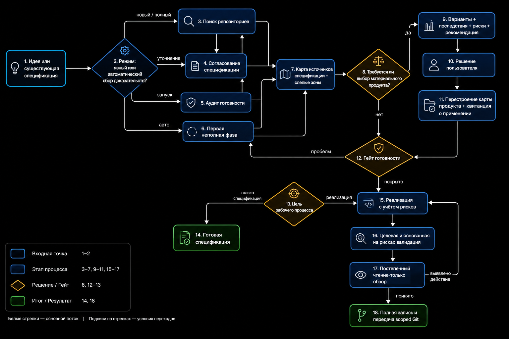
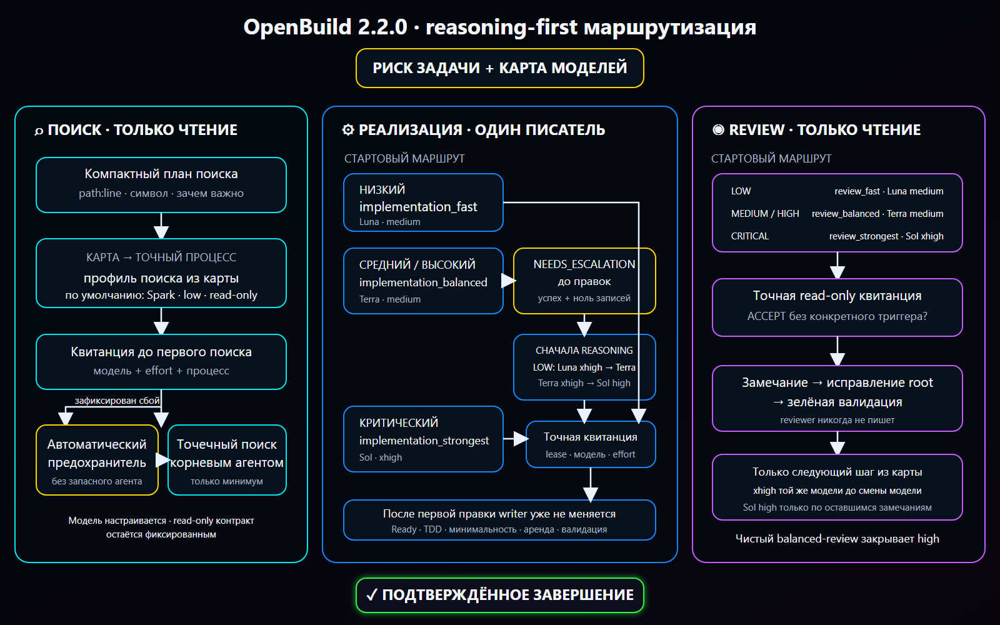

# OpenBuild

[English version](README.md)

OpenBuild — явно вызываемый workflow для Codex, который может провести задачу или существующую спецификацию от поиска по репозиторию до реализации, проверок и review. Основной маршрут автоматический: вызовите Build, опишите результат, а он сам выберет первый незавершённый этап.

Текущий релиз: `2.2.0` ([закреплённый исходник skill](https://github.com/GeorgVahi/OpenBuild/tree/v2.2.0/plugins/openbuild/skills/build)).

## Схемы

### Общий workflow



### Точная маршрутизация моделей



### Делегирование реализации


## Требования

- Codex с поддержкой plugins;
- Python 3.11 или новее;
- Codex CLI с сохранённым входом через ChatGPT;
- Git для работы с репозиторием и релизами.

Прямые API-ключи не нужны. Делегированные агенты запускаются отдельными процессами Codex CLI через подписочную авторизацию.

## Установка или обновление

Удалите текущую установку и источник marketplace:

```powershell
codex plugin remove openbuild@openbuild
codex plugin marketplace remove openbuild
```

Добавьте последний закреплённый релиз и установите plugin:

```powershell
codex plugin marketplace add GeorgVahi/OpenBuild --ref v2.2.0
codex plugin add openbuild@openbuild
```

После установки начните новый тред Codex, чтобы загрузилась обновлённая версия skill.

## Использование

Вызовите `$openbuild:build` и опишите желаемый результат. Без явного режима Build работает в `auto` и сам решает, нужно ли создать, улучшить или выполнить спецификацию.

Дополнительные режимы:

- `new <идея>` — создать или уточнить спецификацию без реализации;
- `refine <путь>` — сверить существующую спецификацию с репозиторием;
- `run <путь>` — реализовать существующую спецификацию;
- `full <идея>` — пройти путь от спецификации до реализации и review;
- `auto <идея-или-путь>` — явно запросить автоматический маршрут;
- `configure-models` — пройти понятное интервью и выбрать первую модель, шаги эскалации по доказательству, reasoning effort и критические маршруты для поиска, критиков спецификации, реализации и review.

Для существующей спецификации передайте относительный от репозитория или абсолютный путь. Build не выбирает молча между несколькими подходящими файлами.

## Агенты с точным выбором модели

OpenBuild поставляет готовые профили для поиска, реализации и review. Каждый создаваемый агент запускается только через встроенный `codex-exec-explicit-model` runner: он передаёт точную модель, reasoning effort, sandbox и задачу в отдельный процесс `codex exec`, а затем сохраняет terminal receipt.

Приоритет карты моделей и профилей: override проекта, override пользователя, затем встроенные значения. `$openbuild:build configure-models` собирает полную проектную или пользовательскую карту простыми вопросами; Build разрешает её перед каждым агентом. Модель поиска можно менять, но канонический read-only контракт поиска остаётся неизменяемым. Native Explorer, name-only custom agents, generic workers и другие маршруты без доказуемых model/effort не используются.

Если точный поиск не запустился, Build фиксирует причину и выполняет только минимальный targeted root search. Ошибка точного implementation- или review-агента оставляет gate незавершённым вместо подмены агентом с неизвестной моделью.

Встроенная карта сначала повышает reasoning и лишь затем меняет модель. Low-risk реализация и review стартуют на Luna medium, затем используют Luna xhigh, Terra medium, Terra xhigh и только по оставшемуся подтверждённому триггеру — Sol high. Маршруты medium/high начинают с Terra medium, переходят на Terra xhigh перед Sol high; critical сразу получает Sol xhigh. Проверенная пользовательская карта может выбрать более короткий непрерывный сегмент или более высокий non-Sol старт внутри той же risk-ladder, но не может пропустить reasoning-ступень, начать non-critical работу с Sol, использовать critical-only strongest вне critical или заменить прямой strongest-маршрут для critical. Override канонического implementation/review-профиля также обязан объявить точный `routing_rung` и `routing_tuple_confirmed = true`: известная пара Luna/Terra/Sol model+effort должна совпадать с этой ступенью, а неизвестная custom-модель требует явно подтверждённой ступени и capability smoke без догадок по её имени.

## Безопасные timeout и recovery

Ограниченный `wait` timeout — только наблюдение: OpenBuild следит за тем же run через прогрессивные окна 45, 90 и 120 секунд, используя мягкий CLI exit при сохранении `status: timeout`. Он не освобождает writer lease, не запускает замену и не меняет модель, пока creation-bound дерево процессов может оставаться живым; после третьего наблюдения показывает статус, а не отменяет run автоматически. OpenBuild принимает contained handoff только после terminal receipt, kernel-backed доказательства нулевого дерева, независимой проверки root и durable finalization.

Implementation recovery никогда не запускается автоматически. После terminal failure contained-run, доказанного опустошения всего дерева процессов и повторного совпадения неизменяемого checkpoint пользователь может явно разрешить ровно один recovery target для того же ограниченного scope. Capture checkpoint fail-closed отклоняет скрывающие status флаги Git index и проверяет каждый компонент Windows-пути на reparse point, поэтому скрытое tracked-изменение или junction-предок не может вывести allowed inventory за workspace. Непосредственно перед activation registry повторно снимает точный snapshot normal source или recovery target; drift сохраняет contained lease неактивированным и не открывает prompt gate. Каждое поколение registry и private source проверяется по точным allowlist-схемам верхнего и вложенных уровней до durable replace и повторно при reload; неизвестное lifecycle-поле, неверное state-specific evidence или raw path в public checkpoint fail-closed отклоняется даже с пересчитанным digest поколения. Поколение contained process-bound дополнительно обязано связать provider/IPC plan ID, identity guardian, утвердительное precommit membership и PID/creation identity worker с зарезервированным планом до reload или activation. Terminal zero proof и guardian close являются полными exact-записями, привязанными к тому же provider, guardian и process identity. Transport-completed результат `BLOCKED` или подтверждённый zero-write `NEEDS_ESCALATION` durable-отклоняется без handoff до закрытия containment. Его disposition следует точной матрице: `BLOCKED` сохраняет source checkpoint, а `NEEDS_ESCALATION` сначала требует свежий private snapshot, byte-equal авторитетному pre-snapshot, не может сохранить checkpoint и завершается только при одном совпадающем registry-history event и reload-валидированной invalidation приватного source. Эскалация сохраняет возобновляемую границу checkpoint-invalidation: ошибка удерживает lease, и только durable completion разрешает закрытие containment, освобождение и следующий шаг маршрута. После очистки lease остаётся валидируемый privacy-safe digest-архив terminal receipt, kernel zero proof, guardian close и semantic/handoff disposition. Failed или ambiguous handoff не принимается. В Windows worker создаётся suspended, проверяется внутри Job и только затем возобновляется; в Linux worker создаётся сразу внутри cgroup v2 через `clone3(CLONE_INTO_CGROUP)` до exec, после чего дополнительно доказываются приватные cgroup/mount namespaces, read-only controls, сброшенные capabilities, отсутствие control descriptors и неизменное membership. В production Linux-пути нет helper для post-spawn добавления PID. Если такой native boundary недоступен, обычный source-run может один раз перейти на доказанный pre-boundary non-recovery fallback, а recovery остаётся недоступным; неоднозначность создания fallback, захвата identity или durable process bind сохраняет one-shot lease в quarantine. Уже видимый bind-replace повторно проходит barrier и принимается только при точном совпадении digest и process receipt.

## Progressive review

Review выполняется последовательно и только для чтения. Build начинает с уровня, соответствующего риску изменений, принимает подтверждённый чистый результат и поднимается ровно на один уровень только после конкретного нерешённого замечания, исправления и повторной проверки. Для принятого review обязательны успешный receipt точного runner’а и семантически завершённый результат.

## Репозиторий и Git

OpenBuild соблюдает применимые `AGENTS.md` и инструменты репозитория, сохраняет посторонние изменения worktree, допускает только одного активного writer и оставляет Git-операции root-оркестратору. Разрушительные, внешние, security-sensitive действия и решения, принадлежащие пользователю, по-прежнему требуют явного разрешения.

## Разработка

Проверка пакета находится в `scripts/validate_package.py`, рядом лежат тесты runner’а и контрактов. Правила релиза описаны в [CONTRIBUTING.md](CONTRIBUTING.md), изменения релизов — в [CHANGELOG.md](CHANGELOG.md).

## Лицензия

[MIT](LICENSE)
