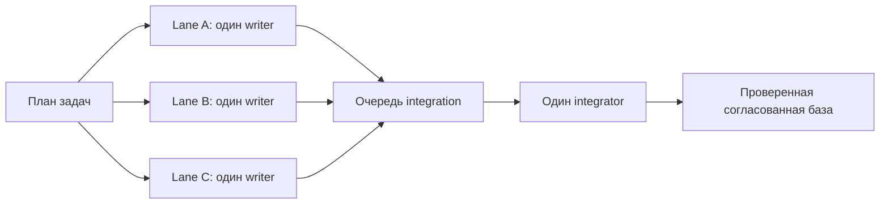

# OpenBuild

[English version](README.md)
OpenBuild — явно вызываемый workflow для Codex, который может провести задачу или существующую спецификацию от поиска по репозиторию до реализации, проверок и review. Основной маршрут автоматический: вызовите Build, опишите результат, а он сам выберет первый незавершённый этап.
Текущий релиз: `2.4.1` ([закреплённый исходник skill](https://github.com/GeorgVahi/OpenBuild/tree/v2.4.1/plugins/openbuild/skills/build)).
OpenBuild сам управляет рутинной оркестрацией агентов: сразу активирует выбранный exact-agent, продолжает наблюдать живой процесс в пределах одного 15-минутного окна и применяет проверенный same-scope retry или переход на одну ступень без постоянных вопросов пользователю. Решения о продукте, архитектуре, разрешениях, приватности, разрушительных и внешних действиях и публикации остаются за пользователем.

## Схемы

### Общий workflow


### Точная маршрутизация моделей


### Делегирование реализации


### Параллельные task lanes



## Требования

- Codex с поддержкой plugins;
- Python 3.11 или новее;
- Codex CLI с сохранённым входом через ChatGPT;
- Git для работы с репозиторием и релизами.

Прямые API-ключи не нужны. Делегированные агенты запускаются отдельными процессами Codex CLI через подписочную авторизацию.

## Установка или обновление

Удалите текущую установку и источник marketplace:

```powershell
codex plugin remove openbuild@openbuild
codex plugin marketplace remove openbuild
```

Добавьте последний закреплённый релиз и установите plugin:

```powershell
codex plugin marketplace add GeorgVahi/OpenBuild --ref v2.4.1
codex plugin add openbuild@openbuild
```

После установки начните новый тред Codex, чтобы загрузилась обновлённая версия skill.

## Использование

Вызовите `$openbuild:build` и опишите желаемый результат. Без явного режима Build работает в `auto` и сам решает, нужно ли создать, улучшить или выполнить спецификацию.

Дополнительные режимы:

- `new <идея>` — создать или уточнить спецификацию без реализации;
- `refine <путь>` — сверить существующую спецификацию с репозиторием;
- `run <путь>` — реализовать существующую спецификацию;
- `full <идея>` — пройти путь от спецификации до реализации и review;
- `auto <идея-или-путь>` — явно запросить автоматический маршрут;
- `configure-models` — пройти понятное интервью и выбрать первую модель, шаги эскалации по доказательству, reasoning effort и критические маршруты для поиска, критиков спецификации, реализации и review.

Для существующей спецификации передайте относительный от репозитория или абсолютный путь. Build не выбирает молча между несколькими подходящими файлами.

## Параллельные task lanes и автоматический setup

OpenBuild теперь следует проектной модели «parallel tasks, one writer per lane, one integrator». Независимые milestones могут выполняться параллельно в отдельных зарегистрированных Git worktree с непересекающимися hard scopes и изолированными port, test database, Docker Compose, temporary и build namespaces. В каждой lane по-прежнему ровно один contained writer. Завершённые lanes удерживают scopes, пока один project-wide integration owner не проверит и не примет их по порядку; workers никогда не создают commits, не интегрируют, не выдают версии, не выполняют push, tag или publication.

Каждый явный режим `$openbuild:build` запускает встроенный pre-repository setup до первого чтения репозитория или discovery dispatch. Отсутствующий owner-private coordinator I0 создаётся автоматически, существующий корректный coordinator проверяется без rewrite, после чего Build продолжает исходный запрошенный режим. Постоянный ключ coordinator и неизменяемый anchor lock связывают все последующие BA0 records, intent, handoff, compaction, поколения проекта и transition receipts. Стандартные команды `codex plugin marketplace add` и `codex plugin add` не имеют install hook, а отдельной обязательной setup-команды нет.

Если существующее состояние coordinator небезопасно, повреждено, проходит через symlink/reparse point или неоднозначно по другой причине, Build возвращает `setup-required` и останавливается до касания репозитория. Не удаляйте и не создавайте это состояние заново вслепую. Восстановите coordinator root, identity lock, key и owner-only permissions из достоверного evidence для той же OS-учётной записи, затем повторите исходный вызов Build.

Bootstrap имеет два явных исхода. Clean evidence публикует один project registry B0 поколения zero. Breach или indeterminate evidence вместо этого публикует incident BS, сохраняет protected work и блокирует обычные мутации, пока каждый target не доказан vacant, drained, reconciled и cleared. BS aliases покрывают те же recovery-owner operations, что и их ordinary registry counterparts, а все восемь non-creating read/observation paths остаются sink-free. Prompt staging использует один parent transition receipt для всех своих aliases, и каждая durable mutation потребляет ровно один transition context, привязанный к generation и attempt.

### Migration, rollback и publication fences

Переходите с 2.3.6 через one-time drain: завершите или безопасно остановите активные legacy Build processes, обновите все активные clients и отключите архивные legacy entry points до admission managed lanes. Точные legacy registry shapes читаются без rewrite, но первый durable-переход 2.4.0 поднимает reader и writer floors. Client более низкой версии или незарегистрированный client не может менять project state, освобождать scope или разрешать integration. Активный legacy worktree остаётся external protected actor и блокирует конфликтующий admission, пока его vacancy не доказана. Vacant project registry можно retire; downgrade или rollback отклоняются, пока work, fences или protected actors остаются активными.

Это условная гарантия безопасности, а не атомарное исключение архивного legacy binary. Если legacy process снова появляется или меняет worktree, index, ref, process tree либо registry после drain, или observation неполон, OpenBuild записывает global-integrity incident, сохраняет всю обнаруженную работу и safe-stop’ит managed transitions. Перед возобновлением reconciliation обязана доказать точный project/session/generation/attempt и vacancy.

Локальные операции version, package и commit ограждены отдельно классом `O6`; push, annotated tag, GitHub Release, public audit и remote install/smoke — классом `O7`. Incident блокирует оба класса, но снятие локального commit fence не означает authority на publication. Public status projection показывает running, ожидание scope, capacity и integration, stale, blocked, incident и complete без private paths, credentials, ports, nonces и process identities.

## Агенты с точным выбором модели

OpenBuild поставляет готовые профили для поиска, реализации и review. Каждый создаваемый агент запускается только через встроенный `codex-exec-explicit-model` runner: он передаёт точную модель, reasoning effort, sandbox и задачу в отдельный процесс `codex exec`, а затем сохраняет terminal receipt.

Приоритет карты моделей и профилей: override проекта, override пользователя, затем встроенные значения. `$openbuild:build configure-models` собирает полную проектную или пользовательскую карту простыми вопросами; Build разрешает её перед каждым агентом. Модель поиска можно менять, но канонический read-only контракт поиска остаётся неизменяемым. Native Explorer, name-only custom agents, generic workers и другие маршруты без доказуемых model/effort не используются.

Discovery возвращает строгий JSON `openbuild.discovery.v1`. Runner снимает content-sensitive fingerprint всех tracked и untracked/non-ignored файлов Git до и после read-only scout, а затем проверяет ограниченные owners, tests, couplings, flows, безопасные пути и точные диапазоны строк до любого consume со стороны root.

Встроенный маршрут сначала запускает `gpt-5.3-codex-spark`. Только если этот созданный процесс полностью остановлен, его creation-bound ненулевой Codex exit совпадает с чистым runner exit, а приватное structured evidence доказывает недоступность Spark для аккаунта либо исчерпание её model-specific лимита, OpenBuild атомарно запускает ровно один канонический Terra-run `openbuild_search_balanced` с тем же prompt, fingerprint, instructions, map и profile bindings. JSONL, stderr и result остаются привязаны к одному проверенному no-follow дескриптору обычного файла до конца чтения; подмена между проверкой, открытием и EOF отклоняется fail-closed. Message-only и generic failures, auth/network/CLI/sandbox/timeout, невалидный result, drift, replay и ошибка Terra сразу ведут к минимальному targeted root search; третьего агента и подмены агентом с неизвестной моделью нет. Старые полные карты без optional availability-полей сохраняют прежний blocked-контракт. Implementation и review никогда не подменяют модель после transport failure.

Встроенная карта сначала повышает reasoning и лишь затем меняет модель. Low-risk реализация и review стартуют на Luna medium, затем используют Luna xhigh, Terra medium, Terra xhigh и только по оставшемуся подтверждённому триггеру — Sol high. Маршруты medium/high начинают с Terra medium, переходят на Terra xhigh перед Sol high; critical сразу получает Sol xhigh. Проверенная пользовательская карта может выбрать более короткий непрерывный сегмент или более высокий non-Sol старт внутри той же risk-ladder, но не может пропустить reasoning-ступень, начать non-critical работу с Sol, использовать critical-only strongest вне critical или заменить прямой strongest-маршрут для critical. Override канонического implementation/review-профиля также обязан объявить точный `routing_rung` и `routing_tuple_confirmed = true`: известная пара Luna/Terra/Sol model+effort должна совпадать с этой ступенью, а неизвестная custom-модель требует явно подтверждённой ступени и capability smoke без догадок по её имени.

## Безопасные timeout и recovery

Ограниченный `wait` timeout — только наблюдение: OpenBuild следит за тем же run через прогрессивные окна 45, 90 и 120 секунд, используя мягкий CLI exit при сохранении `status: timeout`. После этих checkpoint OpenBuild автоматически продолжает наблюдение в пределах одного неизменяемого 15-минутного бюджета; на hard deadline он сам отменяет run и требует доказательства полной остановки дерева процессов. Он не освобождает writer lease, не запускает замену и не меняет модель, пока creation-bound дерево процессов может оставаться живым, и не спрашивает пользователя, продолжать ли штатное ожидание. OpenBuild принимает contained handoff только после terminal receipt, kernel-backed доказательства нулевого дерева, независимой проверки root и durable finalization.

Допустимое безопасное same-scope продолжение выполняется автоматически и ограниченно: OpenBuild может использовать one-shot same-profile retry или существующее root-completion authority только после обязательного zero-write либо post-stop evidence. Только новый checkpoint-bound recovery target writer требует явного разрешения пользователя. После terminal failure contained-run, доказанного опустошения всего дерева процессов и повторного совпадения неизменяемого checkpoint пользователь может явно разрешить ровно один recovery target для того же ограниченного scope. Capture checkpoint fail-closed отклоняет скрывающие status флаги Git index и проверяет каждый компонент Windows-пути на reparse point, поэтому скрытое tracked-изменение или junction-предок не может вывести allowed inventory за workspace. Непосредственно перед activation registry повторно снимает точный snapshot normal source или recovery target; drift сохраняет contained lease неактивированным и не открывает prompt gate. Каждое поколение registry и private source проверяется по точным allowlist-схемам верхнего и вложенных уровней до durable replace и повторно при reload; неизвестное lifecycle-поле, неверное state-specific evidence или raw path в public checkpoint fail-closed отклоняется даже с пересчитанным digest поколения. Поколение contained process-bound дополнительно обязано связать provider/IPC plan ID, identity guardian, утвердительное precommit membership и PID/creation identity worker с зарезервированным планом до reload или activation. Terminal zero proof и guardian close являются полными exact-записями, привязанными к тому же provider, guardian и process identity. Transport-completed результат `BLOCKED` или подтверждённый zero-write `NEEDS_ESCALATION` durable-отклоняется без handoff до закрытия containment. Его disposition следует точной матрице: `BLOCKED` сохраняет source checkpoint, а `NEEDS_ESCALATION` сначала требует свежий private snapshot, byte-equal авторитетному pre-snapshot, не может сохранить checkpoint и завершается только при одном совпадающем registry-history event и reload-валидированной invalidation приватного source. Эскалация сохраняет возобновляемую границу checkpoint-invalidation: ошибка удерживает lease, и только durable completion разрешает закрытие containment, освобождение и следующий шаг маршрута. После очистки lease остаётся валидируемый privacy-safe digest-архив terminal receipt, kernel zero proof, guardian close и semantic/handoff disposition. Failed или ambiguous handoff не принимается. В Windows worker создаётся suspended, проверяется внутри Job и только затем возобновляется; в Linux worker создаётся сразу внутри cgroup v2 через `clone3(CLONE_INTO_CGROUP)` до exec, после чего дополнительно доказываются приватные cgroup/mount namespaces, read-only controls, сброшенные capabilities, отсутствие control descriptors и неизменное membership. В production Linux-пути нет helper для post-spawn добавления PID. Если такой native boundary недоступен, обычный source-run может один раз перейти на доказанный pre-boundary non-recovery fallback, а recovery остаётся недоступным; неоднозначность создания fallback, захвата identity или durable process bind сохраняет one-shot lease в quarantine. Уже видимый bind-replace повторно проходит barrier и принимается только при точном совпадении digest и process receipt.

Версия 2.4.1 делает продолжение самовосстанавливающимся для классов инцидентов, где уже существуют безопасные evidence и authority. Recovery snapshot использует `task-relevant-v2`: allowed-файлы, включая явно разрешённые ignored-файлы, и все Git-visible status paths остаются защищены, а посторонние ignored `.scratch`, `node_modules`, крупные caches и reparse points не перечисляются глобально, не открываются и не расходуют checkpoint budget. Старые sources без policy продолжают проверяться в глобальном `full-ignored-v1` без rewrite. После reconciliation quarantine, terminal abandonment, semantic rejection или false-green focused signal атрибутируемый partial diff проходит durable root-completion audit и digest-bound automatic continuation без просьбы повторить RUN или отдельно разрешить «direct fix»; создание нового writer остаётся отдельным security decision. Каждый reviewer dispatch проверяет и дополняет owner-private canonical progress ledger, разделённый по стабильным lineage Build-спецификаций; review limits относятся к одной неизменяемой revision diff, исправленный diff получает свежий последовательный review epoch, а независимый Build стартует отдельно. Если Codex Browser недоступен, OpenBuild может использовать local browser QA только с независимым network guard, подключённым до запуска child; вывод project/child не считается сетевым доказательством, а недоступная изоляция приводит к fail-closed до запуска QA child.

Версия 2.4.0 завершает M7 legacy migration, автоматический setup первого Build, документацию и package contract. Новый migration owner проверяет или инициализирует I0 до discovery репозитория, публикует clean B0 либо breach BS через неизменяемые BA0 records, применяет reader/writer floors и protected legacy work и отдельно ограждает локальные commit operations от внешней publication. Registry-aware validation принимает только доказанные ссылки на transitions `O1`–`O8`, сохраняя negative controls для настоящих fixed-model slugs. M8 публикует этот проверенный неизменяемый candidate через stable tag и GitHub Release, а затем проверяет remote install, automatic setup и работу parallel lanes.

Версия 2.4.0-alpha.2 предварительно выпускает M2 lifecycle project lanes в отдельных Git worktree, сохраняя не более одного contained writer в каждой lane. Coordinator разрешает lane и hard scopes до dispatch; runner проверяет эту приватную привязку, направляет существующий RecoveryRegistry в worktree lane, переводит lane-local lease в `running`, CAS-прикрепляет его к project lane и только затем открывает prompt. Поэтому две непересекающиеся lanes могут одновременно быть write-capable; acceptance fixture запускает два настоящих дерева процессов runner/guardian/fake-Codex и требует, чтобы оба worker одновременно пересекли общий live barrier. Ошибка или timeout quarantines только затронутую lane. Точный containment loss закрывает эту lane лишь после reconciliation и vacancy собственного registry; обычный failure с всё ещё допустимым checkpoint вместо close записывает `recovery-ready`, после чего в ту же lane может войти только явно разрешённый recovery target с тем же digest, пока соседняя lane остаётся live. Точный schema-1 M1 project state остаётся sink-free read и мигрирует только при первом locked lane-session generation CAS. Успешный handoff ждёт будущего integration owner без освобождения project scopes.

Версия 2.4.0 добавляет обычный post-zero reconciliation для завершённого legacy lease вида `normal-contained`, чья свежая revalidation возвращает единственную точную причину `[preexisting-dirty-overlap]`. Owner-derived `terminal-abandonment-v5` связывает run, lease, source, terminal receipt, zero proof, candidate snapshot и allowed set, затем инвалидирует checkpoint причиной `terminal-abandoned-legacy-normal-dirty-overlap` до authenticated guardian close, unsuccessful archive и release того же lease. Переход сохраняет полученные от writer байты и Git index без принятия handoff, diff, commit, retry, escalation, root-completion authority или искусственного outside drift. Точные registry версии 2.3.6 читаются без rewrite; первый durable-переход v5 поднимает reader floor до 2.4.0 перед source invalidation, поэтому retained lifecycle 2.3.6 может повторить исходную приватную команду `_reconcile-terminal-abandonment`, если все исходные owner evidence сохранены.

Версия 2.3.6 расширяет post-zero containment-loss reconciliation только для legacy lease вида `normal-contained`, чья свежая revalidation возвращает точный отсортированный набор `[git-control-plane-drift, outside-set-drift, preexisting-dirty-overlap]`. Owner-derived `terminal-abandonment-v4` связывает этот candidate snapshot, навсегда инвалидирует устаревший checkpoint отдельной причиной и повторно использует authenticated reconciliation, close, archive и release без принятия handoff, diff, commit или root-completion authority. Та же тройка остаётся недопустимой для обычной `_reconcile-terminal-abandonment`; любые другие дополнительные или control-plane reasons остаются no-mutation fail-closed. Точные floors вплоть до 2.3.5 читаются без rewrite, а первый durable-переход 2.3.6 поднимает floor до invalidation source.

Версия 2.3.4 восстанавливает root completion после таймаута активированного `normal-legacy`. Когда остановка failed process tree доказана, post-vacancy audit принимает этот activated `normal-legacy` failure release только если он является единственным registry-history событием с lease ID запроса, handoff отсутствует, а неизменяемые run, task, profile, process identity, allowed-set digest и binding ревизии спецификации совпадают. Новые run сохраняют структурированную source binding до activation и повторяют её digest в durable activated receipt и повторно вычисленном failed/stopped terminal receipt. Run версии 2.3.3 после checkpoint-limit, где поле отсутствует, а не равно явному `null`, принимается только по его точной migration-форме, канонической ревизии `R-<digits>` и уже связанному с task label точному lowercase-токену `r<digits>`. Повторно использованная или mixed-kind история lease отклоняется fail-closed. Этот путь не запускает writer, не принимает worker handoff и по-прежнему требует независимой атрибуции partial diff до root-only completion.

Версия 2.3.3 не позволяет короткому default timeout внешнего controller прервать atomic dispatch handshake: каждый `dispatch` для search, critic, implementation и review теперь получает явный внешний controller budget не менее 120 секунд (`120000` миллисекунд для инструментов с миллисекундной настройкой). Этот бюджет покрывает authentication preflight, запуск containment, готовность creation-bound Codex и публикацию activated receipt; он не входит в неизменяемый 15-минутный observation budget уже активированного run. Timeout controller до получения receipt остаётся fail-closed transport failure и не разрешает replacement writer внутри того же lifecycle. Релиз также исправляет activation обычной implementation-задачи при недоступном checkpoint capture, включая `checkpoint byte limit exceeded`: lease `normal-legacy` теперь получает domain-separated lowercase SHA-256 запрошенного allowed set вместо пустого `activation_allowed_set_digest`. Эта binding разрешает activation, но не изображает наличие checkpoint recovery capability.

## Progressive review

Review выполняется последовательно и только для чтения. Build начинает с уровня, соответствующего риску изменений, принимает подтверждённый чистый результат и поднимается ровно на один уровень только после конкретного нерешённого замечания, исправления и повторной проверки. Для принятого review обязательны успешный receipt точного runner’а и семантически завершённый результат.

Review budget относится к одному стабильному lineage Build-спецификации и неизменяемому full diff, который действительно проверялся. Существенное исправление начинает свежий последовательный epoch для нового diff и сохраняет canonical evidence `openbuild.review-progress.v2` со стабильными finding keys; последующий независимый Build в том же репозитории начинает собственный первый review. Повтор неизменённого finding или изменение только diff без продвижения validation, acceptance coverage либо closure замечания завершает автоматический review как `automation-exhausted`, а не просит очередное процедурное разрешение.

## Репозиторий и Git

OpenBuild соблюдает применимые `AGENTS.md` и инструменты репозитория, сохраняет посторонние изменения worktree, допускает только одного активного writer и оставляет Git-операции root-оркестратору. Разрушительные, внешние, security-sensitive действия и решения, принадлежащие пользователю, по-прежнему требуют явного разрешения.

## Разработка

Проверка пакета находится в `scripts/validate_package.py`, рядом лежат тесты runner’а и контрактов. Правила релиза описаны в [CONTRIBUTING.md](CONTRIBUTING.md), изменения релизов — в [CHANGELOG.md](CHANGELOG.md).

## Лицензия

[MIT](LICENSE)
